# Simple Dune Server Management Tool

> By Coastal (Discord `@allcoast`). A Windows management portal for your
> self-hosted **Dune: Awakening** dedicated server — without ever opening a
> raw SSH shell or hand-editing YAML.

[](https://github.com/coastal-ms/DST-DuneServerTool/actions/workflows/lint.yml)
[](LICENSE)
[](https://github.com/coastal-ms/DST-DuneServerTool/releases/latest)

The current release is **version X** (shown stylized as **X** in-app; patch
updates display as **X (0.1)**, **X (0.2)**, … under the hood these are
`10.0.0`, `10.0.1`, … so update-checks and version comparisons keep working).
It runs as a single-window Windows app (native WebView2 shell) that hosts a
local web portal (React + Vite + Tailwind) on `127.0.0.1` with a per-launch
tokenized URL. Same battle-tested SSH + Hyper-V + battlegroup automation
under the hood as the legacy CLI. Closing the app window stops the server;
the sidebar's **Web Portal** button hands the portal off to your default
browser and keeps the server running in the background.

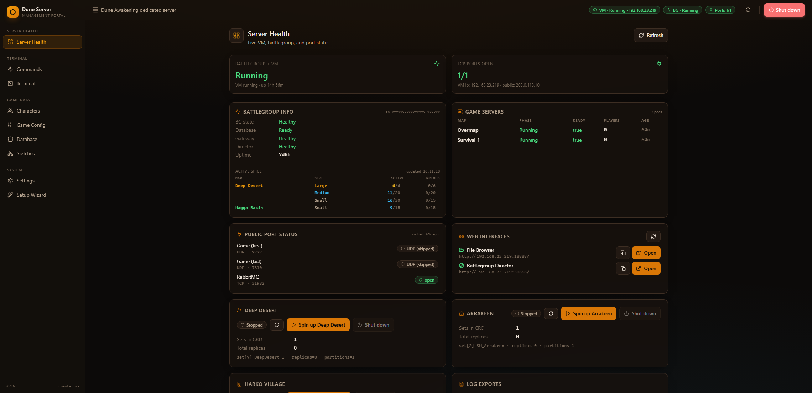

See [`CHANGELOG.md`](CHANGELOG.md) for the full release history and
[`CONTRIBUTING.md`](CONTRIBUTING.md) for the change-control workflow.

### License & attribution

DST is released under the **Apache License 2.0** (see [`LICENSE`](LICENSE)
and [`NOTICE`](NOTICE)). You're welcome to use it, fork it, modify it, and
redistribute it. If you do redistribute or build on top of it, the license
requires you to preserve the `NOTICE` file and credit **Coastal** (Discord
`@allcoast`, project home <https://github.com/coastal-ms/DST-DuneServerTool>)
as the original author. Republishing this tool as your own work without
attribution violates the license — please don't.

---

## Quick install

1. Download **`DuneServerSetup.exe`** from the
   [latest GitHub release](https://github.com/coastal-ms/DST-DuneServerTool/releases/latest).
2. Double-click. The installer walks you through it (one UAC prompt — Hyper-V
   needs admin). The Start Menu shortcut and the launcher EXE are placed in
   `C:\Program Files\Dune Server\`.
3. Launch from **Start Menu → Dune Server**. The launcher binds a free local
   port (47823+), opens the **Dune Server Tool** native app window
   (WebView2) pointed at `http://127.0.0.1:<port>/?t=<token>`, and runs a
   minimized PowerShell console in the background. The first launch opens
   the **Setup Wizard** page, which asks for your server install folder,
   SSH key, and optional dune-admin path. All answers are saved to
   `%APPDATA%\DuneServer\` and preserved across reinstalls.

> The launcher is single-instance — clicking the desktop shortcut again just
> focuses the existing app window. No duplicate UAC prompt, no second window.

> 🌐 **Web Portal button** — the sidebar's **Web Portal** button (footer of
> the left nav, visible only inside the app window) hands the portal off to
> your default browser: it opens the tokenized URL in Chrome/Edge/Firefox,
> closes the app window, and **keeps the server running in the background**.
> Reopen Dune Server Tool any time to bring the app window back — the prior
> background server is stopped and a fresh one is started (one UAC prompt).

---

## What you need

- **Windows 10/11** with **Hyper-V** enabled (Pro / Enterprise / Education).
- **PowerShell 7** (`pwsh`) — [download](https://github.com/PowerShell/PowerShell/releases). The launcher prompts you with this link if it's missing.
- **Microsoft Edge WebView2 Runtime** — ships with Windows 11 and modern
  Windows 10; the installer falls back to your default browser if it's
  missing. The native app window uses WebView2; the **Web Portal** button
  hands off to a standalone browser tab whenever you prefer one.
- **Dune: Awakening Self-Hosted Server** installed via Steam (gives you the
  `battlegroup-management` folder and the Hyper-V VM image).
- **SSH private key** for connecting to your VM — created automatically
  during Funcom's official self-hosted setup; usually in
  `%LOCALAPPDATA%\DuneAwakeningServer\sshKey`.
- **(Optional)** [dune-admin](https://github.com/icehunter/dune-admin) — a
  community admin panel for player/inventory tooling. Launches from the
  Commands page if you provide its path.

---

## The portal — a page tour

The browser window is split into a **left nav rail** (grouped under Server
Health, Terminal, Game Data, System) and a **page surface** on the right.
The persistent **header status bar** at the top shows live VM / battlegroup
/ port status, a **Refresh** button, and a prominent red **Shut down**
button that gracefully stops the local `DuneServer.exe` portal process.

### 🩺 Server Health


The default landing page. Cards for everything you usually want to glance at:

- **Battlegroup + VM** — combined running / stopped state and uptime.
- **TCP Ports Open** — live verdict for each public TCP port (Game first,
  Game last, RabbitMQ).
- **Battlegroup Info** — typed view of `kubectl get bg` (BG state, DB,
  Gateway, Director, Uptime).
- **Game Servers** — per-pod phase, readiness, player count, age.
- **Active Spice** — per-map / per-size-class active vs primed counts,
  pulled live from `dune.public_spicefields` over psql. Tiered colors
  (Large = amber, Medium = blue, Small = muted) and at-cap highlighting.
  Each row also has an **Active** checkbox (v6.1.30+) that toggles
  `dune.spicefield_types.is_spawning_active` live — clicking commits
  immediately through a guard-railed endpoint that only ever writes
  `TRUE`/`FALSE` to that single column. One shared 5-second click
  cooldown across all checkboxes prevents accidental DB hammering
  (live `(Ns)` countdown shown next to the disabled row).
- **Public Port Status** — open / closed / skipped badges for Game (UDP)
  and RabbitMQ (TCP), with a primary + fallback port-check provider.
- **Web Interfaces** — one-click launchers for File Browser and
  Battlegroup Director (URLs visible and copyable).
- **Log Exports** — pull logs from any pod or the operator with one click.

Per-map spin-up / shut-down controls for Deep Desert, Arrakeen, and Harko
Village moved to the dedicated **DD Map** page (see below).

### ⚡ Commands

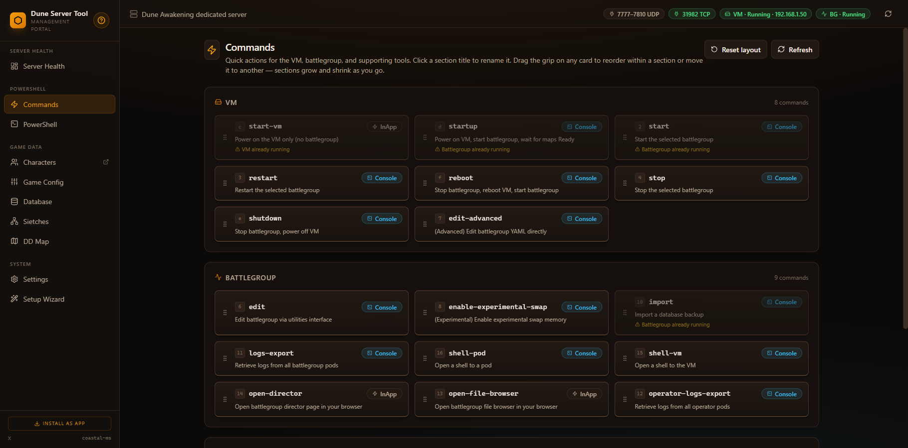

Quick-action cards grouped by **VM**, **Battlegroup**, and **Tools**. Each
card shows whether the command runs **InApp** (in the embedded terminal)
or **Console** (in a popup window for interactive commands). Click the
keyboard hint to fire the card; cards self-disable with a hint when the
action wouldn't make sense right now (e.g. *start* greyed out with
"Battlegroup already running").

Drag the grip on any card to reorder commands within their section — the
order auto-saves to `%APPDATA%\DuneServer\button-order.json` and persists
across launches. The header has a **Reset layout** button to revert to
the default arrangement.

The **dune-admin** launch tile carries an inline
"by [Icehunter](https://github.com/Icehunter)" credit badge linking to
the upstream project (v6.1.29+).

### 🖥️ PowerShell

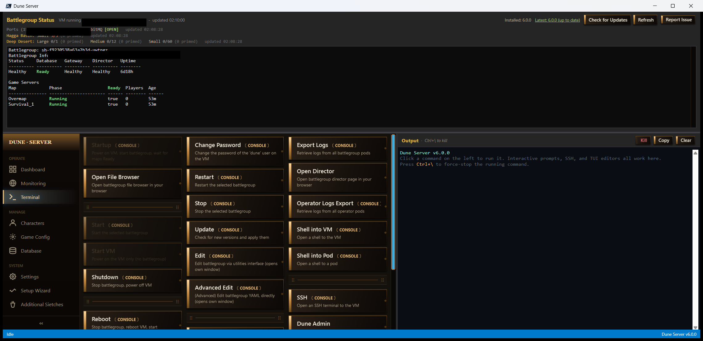

Embedded PowerShell session backed by xterm.js. Runs locally on your
Windows host — use it for `kubectl`, `ssh dune@vm '...'`, and other
one-shot commands. Persistent working directory across commands. Each
WebSocket session owns a dedicated runspace; **Cancel** stops the current
command, **Clear** wipes the buffer, **Reconnect** spins up a fresh
runspace. Note: this is an exec model, not a real PTY — `vim` and `htop`
won't work, but everything else does.

### 👤 Characters

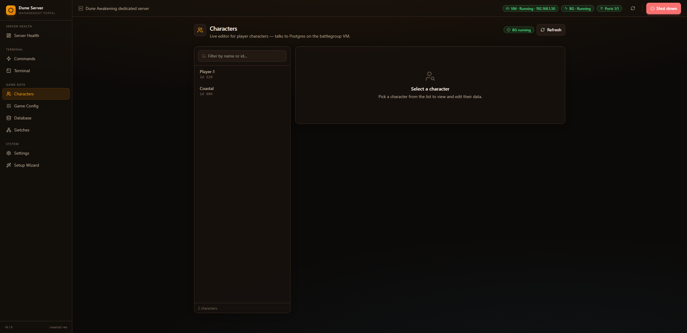

Live editor for every character on your server, talking directly to the
Postgres pod over SSH. Pick a character from the rail, then tab through
**Stats**, **Tech**, **Specs**, **Economy**, **Faction**, **Inventory**,
**Cosmetics**. All edits are written back through `psql` with
transactional safety. Specs and Faction Rep pull live from
`dune.specialization_tracks` and `dune.player_faction_reputation` so
you always see the current numbers.

### ⚙️ Game Config

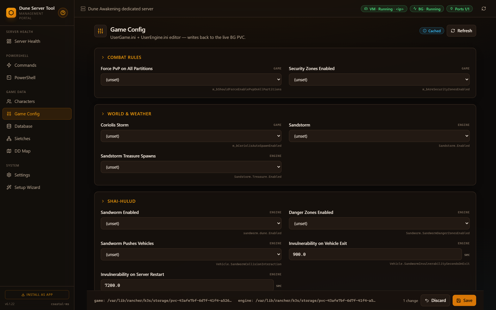

A grouped editor for `UserGame.ini` and `UserEngine.ini`, with every
setting labeled, typed, and showing its underlying key in fine print.
Groups: Combat Rules, World & Weather, Shai-Hulud, Resources & Loot,
Players, Spicefields, Performance, and more. A dedicated **Spicefield
Types** card edits `dune.spicefield_types` directly with at-cap row
highlighting and a live status badge that refreshes every 10s. Each
row includes a live-commit **spawning toggle** (v6.1.29+) that flips
`is_spawning_active` through a guard-railed single-column endpoint,
plus a 5-second per-button click cooldown on toggle + Save to prevent
accidental DB hammering. Save flushes the files back to the VM and
invalidates the Server Health port cache so any port change is
reflected immediately.

### 🗄️ Database

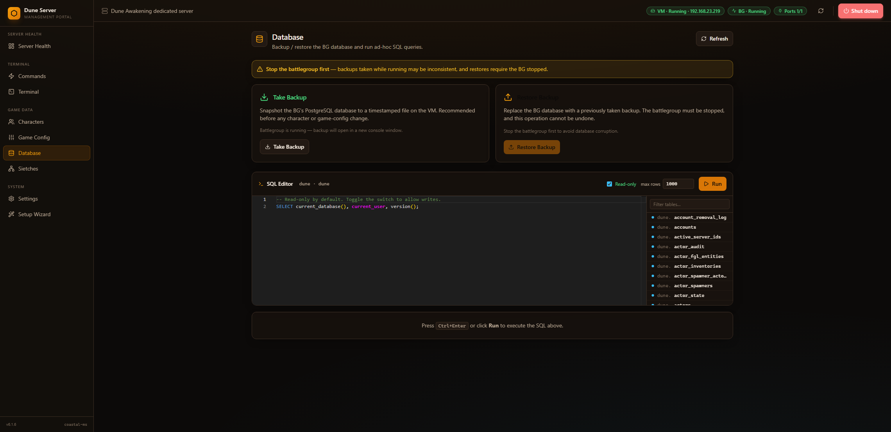

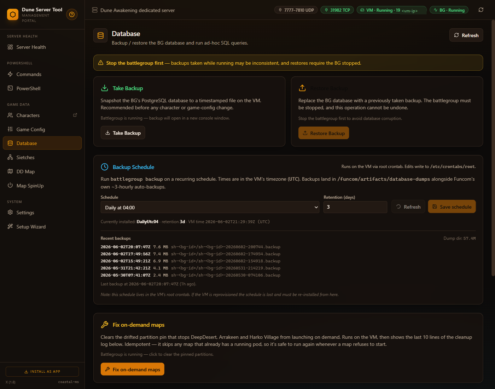

- **Take Backup** / **Restore Backup** for the BG PostgreSQL database
  without remembering pod names. A banner reminds you to stop the BG
  first for a consistent backup.
- **Backup Schedule** (v10.1.8+) — install a recurring `battlegroup backup`
  cron on the VM directly from the UI, with optional auto-pruning of dump
  files older than N days. Presets cover hourly, every six hours, daily 04:00,
  twice daily (04:00 and 16:00), and weekly Monday. The schedule lives in a
  clearly-marked managed block inside root's `/etc/crontabs/root`, is read
  back and verified after each save, and is shown alongside recent backup
  files plus a tail of `/var/log/dune-backup.log`. If a hand-installed
  `battlegroup backup` cron already exists (e.g. the legacy `0 4 * * *` line
  from the backup guide), the card preselects the matching preset and a
  single Save migrates it into the managed block — without leaving duplicate
  schedules behind. Backups land in `/funcom/artifacts/database-dumps/<bg>/`
  alongside Funcom's own ~3-hourly auto-backups. The schedule lives on the
  VM, so reprovisioning the VM loses it and it must be re-installed from the
  card.
- **Fix on-demand maps** (v10.0.4+) — one click clears the drifted
  `igwsss.spec.partitions` pin that intermittently stops DeepDesert,
  Arrakeen and Harko Village from launching on demand, then shows the last
  10 lines of the cleanup log inline. Idempotent and skips any map that
  already has a running pod, so it's safe to run repeatedly. Also available
  as the **fix-on-demand-maps** card in the Battlegroup section of the
  Commands page and the CLI Battlegroup menu.
- **SQL Editor** powered by Monaco. Read-only by default; toggle the
  switch to enable writes. Filterable table list sidebar, configurable
  max-rows cap, **Ctrl+Enter** to run.

### 🕸️ Sietches *(experimental)*

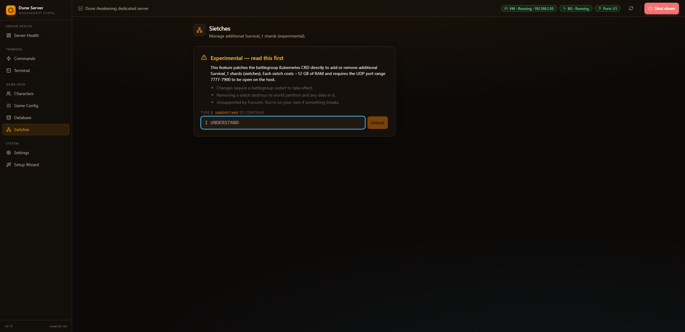

Experimental page for adding or removing additional Survival_1 shards
(sietches). Each sietch costs ~12 GB of RAM and requires the UDP port
range 7777–7900 to be open on the host. Gated behind an
**I UNDERSTAND** confirmation prompt — patches the battlegroup CRD
directly. Unsupported by Funcom; you're on your own if something breaks.

### 🗺️ DD Map

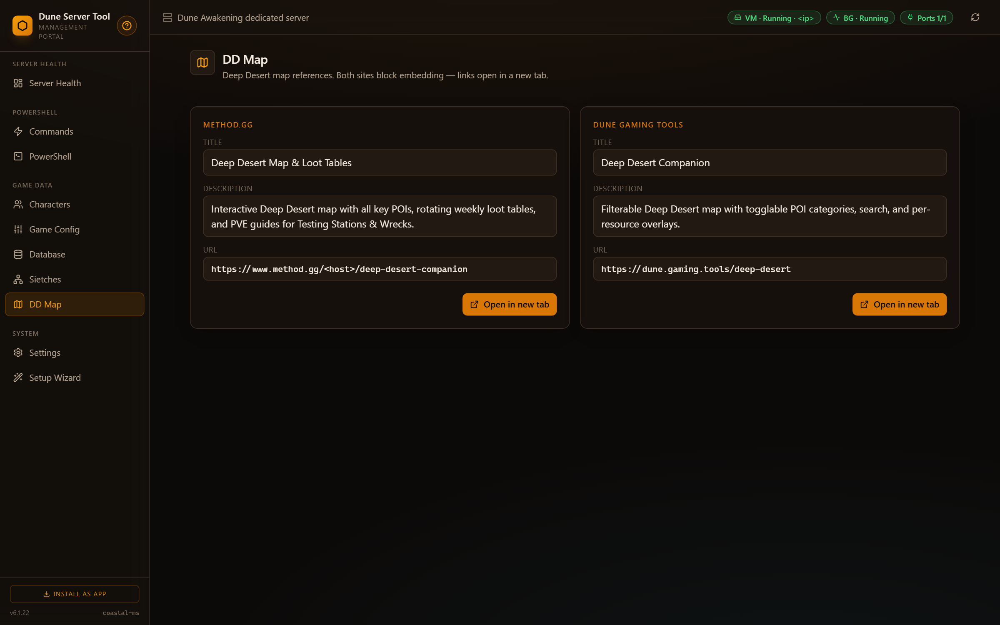

Two link cards (method.gg + dune.gaming.tools) for the interactive Deep
Desert maps the community maintains. Both target sites send
`X-Frame-Options: SAMEORIGIN`, so we can't embed them directly — clicking
**Open in new tab** launches each in your browser. Replaces the per-map
spin-up cards that used to live on Server Health (those moved here in
v6.1.17).

### 🔧 Settings

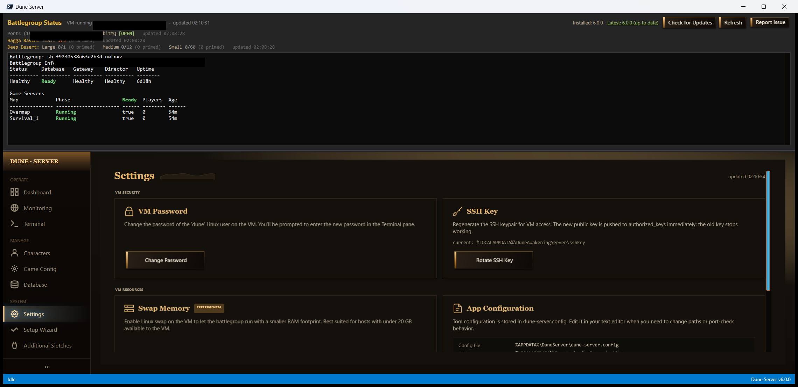

All the things the Setup Wizard asked you, but editable any time:

- Steam install path (where Funcom dropped the dedicated server)
- SSH key path (private key into the dune-awakening VM)
- `dune-admin.exe` path (optional)
- Windows username (used for desktop shortcut creation)
- **Port-check mode** — `builtin` (yougetsignal + canyouseeme fallback),
  `yougetsignal` only, `canyouseeme` only, `custom` (your own URL), or
  `disabled`
- Port-check URL template (when mode is `custom`)

Changes save on-click — no restart needed. The three path fields (Steam path,
SSH key, `dune-admin.exe`) each have a **Browse** button that opens a native
Windows folder/file picker.

Two collapsible cards live at the top of the page (both minimized by
default, both auto-check on mount):

- **Updates** — current vs. latest Dune Server Tool version pulled from
  the GitHub Releases API. **Check now** to refresh, **Install** to
  download `DuneServerSetup.exe` and launch the installer wizard
  (interactive — the running portal is killed by PID before the wizard
  copies files, and the wizard's *Launch Dune Server* checkbox handles
  the relaunch).
- **dune-admin.exe** — current vs. latest from
  [Icehunter/dune-admin](https://github.com/Icehunter/dune-admin). **Check
  now** to refresh, **Reinstall vX.Y.Z** to download the Windows zip,
  extract it, and swap the binary in-place. The button is *always*
  enabled — you can reinstall the current version any time, useful after
  a config or patch-file change. Refuses to install while dune-admin is
  running (the file lock check returns *423 Locked*). The current version
  is read from a sidecar `<exe>.version` file written by the installer
  (Go binaries built with goreleaser don't embed a Win32 FileVersionInfo).
  - **Stale `~/.dune-admin` config check (v10.0.1+).** Before a reinstall or
    setup run, if a `%USERPROFILE%\.dune-admin` config folder already exists
    the portal shows an in-app confirmation modal (**Cancel** / **Keep &
    continue** / **Delete & continue**). It *never* deletes without you
    clicking **Delete & continue** — *Keep* leaves it and proceeds, *Cancel*
    aborts entirely. (Earlier builds relied on a browser `confirm()` dialog
    that could be silently suppressed and auto-delete the folder — fixed.)
    When you do choose **Delete & continue** on a reinstall, the market bot's
    config and DB pointers are gone, so DST reopens dune-admin once the
    install (and any pricing-patch rebuild) finishes — letting you re-run
    market-bot setup right away (v10.0.4+).
  - **Keep Coastal's sane-pricing patch applied after each update**
    (checkbox, saved as `AutoApplyPricingPatch`). When checked, the tool
    *also* downloads the matching `dune-admin_X.Y.Z_source.tar.gz`,
    overlays the upstream source over your dune-admin folder, applies the
    bundled 100k-cap pricing patch, runs `go build`, and restarts
    dune-admin — all in one click. Replaces the manual "Apply Sane-Pricing
    Patch" Database card from v6.1.20. Requires `go` and `git` on PATH.
    Uncheck and click Reinstall to go back to the stock upstream binary.

    The patch caps every bot-generated listing at **100,000 solari** and
    realigns dune-admin's default grade / rarity / vendor multipliers to
    Coastal's tier-driven curve. With it applied, the in-game Market Board
    looks like this — bot listings (e.g. Buggy Booster Mk3, Adept Sword,
    Bluddshot Buggy Engine Mk3) sit well below the cap, while player
    listings that aren't undercut by the bot can still exceed it:

    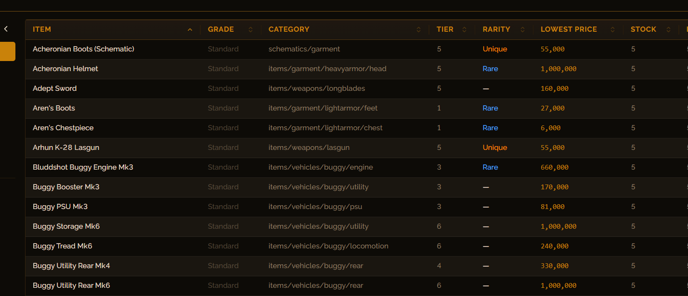

    **d12 gamble-buy (v6.1.32+):** the same bundled patch also changes how the
    market bot *buys* player listings. Instead of buying only when a listing is
    at or below the bot's reference price, the bot now rolls a **12-sided die**
    for each candidate listing on every buy tick — only a **5** buys the item,
    **regardless of price**; any other roll skips it. The per-tick `MaxBuys`
    cap and the unknown / non-buyable / disabled-item safety skips still apply.
    This replaces the old price-threshold buy gate referenced on the bot's
    market control (Revy) page.

    **Configurable buy odds (v6.3.0+):** the die size and the winning roll are
    no longer fixed. Two inputs on the Settings page — **Die size (N)** and
    **Buy on roll** — let you tune how aggressively the bot buys. The bot rolls a
    1–N die per candidate listing and only buys on the target number, so a larger
    die means fewer buys (e.g. `20` / `7` ≈ a 1-in-20 chance per listing). Values
    are saved as `GambleDieSize` / `GambleTarget` and **baked into the patched
    binary at build time**, so they take effect on the next patch (re)apply —
    click **Install** with the "keep sane-pricing patch applied" box checked to
    rebuild. The defaults (12 / 5) reproduce the original behaviour exactly.

    **Wiping bot listings (v10.1.7+):** the portal's old "Wipe all listings"
    testing button has been removed. dune-admin now ships its own **Wipe
    Listings** control in its market-bot panel, which owns that job directly —
    use that when you need the bot to re-list everything from scratch.

### 🧙 Setup Wizard

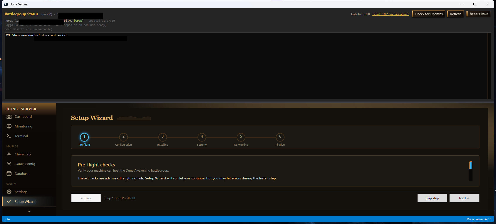

Six-step linear flow that runs automatically on first launch:

1. **Pre-flight** — admin check, Hyper-V module, disk space, OS, config
2. **Configuration** — confirm tool settings
3. **Installing** — import the Hyper-V VM
4. **Security** — SSH + firewall
5. **Networking** — ports + DNS
6. **Finalize** — wrap-up

Re-runnable any time from the nav rail for a clean reset.

---

## Where things live

| Item                           | Path                                                       |
| ------------------------------ | ---------------------------------------------------------- |
| Install dir                    | `C:\Program Files\Dune Server\`                            |
| Config / state                 | `%APPDATA%\DuneServer\`                                    |
| Setup config                   | `%APPDATA%\DuneServer\dune-server.config`                  |
| Commands layout                | `%APPDATA%\DuneServer\button-order.json`                   |
| Server log (taskbar console)   | `%LOCALAPPDATA%\DuneServer\dune-server.log`                |
| Last portal URL                | `%LOCALAPPDATA%\DuneServer\last-url.txt`                   |
| SSH key (created by Funcom)    | `%LOCALAPPDATA%\DuneAwakeningServer\sshKey`                |
| Start Menu shortcut            | *Start → Dune Server → Dune Server*                        |
| Live logs                      | Click the minimized **Dune Server** entry in your taskbar  |

Uninstalling removes the install dir but **never touches
`%APPDATA%\DuneServer\`** — your config is preserved if you ever reinstall.

---

## Auto-update

The portal polls the public GitHub Releases API on a 6-hour cadence (also
cached for 1h server-side). When a newer tag is published with an attached
`DuneServerSetup*.exe`, an amber banner appears above the status bar with
**Update now** / **Later** buttons. **Update now** downloads the asset to
`%TEMP%\DuneServerUpdate\` and launches the installer **wizard** — the
detached relauncher kills the current `DuneServer.exe` by PID, the wizard
walks through the standard pages, and the *Launch Dune Server* checkbox on
the Finished page brings the portal back up. As of v6.1.30 the relauncher
runs in a visible window (with a brief "Installing update..." banner) and
explicitly raises the wizard's main window so it appears in the foreground
instead of being hidden behind the browser or other windows. Your config
in `%APPDATA%\DuneServer\` is preserved across upgrades.

You can also check manually from **Settings → Updates → Check now**.

---

## CLI launcher *(`dune-server.bat`)*

The repo also ships a menu-driven PowerShell CLI for scripting one-off
commands without launching the portal (e.g. from a scheduled task). Clone
the repo (or download the source zip), then double-click `dune-server.bat`
or invoke it with `-Cmd <name>`:

```powershell
.\dune-server.bat              # interactive menu
.\dune-server.bat -Cmd version # print installed version
```

The portal and the `.bat` file both call into the same `dune-server.ps1`
business logic — they're not separate codebases.

---

## Reporting issues

Hit a bug, error, or unexpected behavior? **Please open a GitHub issue**
so it can be tracked and fixed:

> 👉 [**Open an issue**](https://github.com/coastal-ms/DST-DuneServerTool/issues/new/choose) &nbsp;·&nbsp;
> [Browse existing issues](https://github.com/coastal-ms/DST-DuneServerTool/issues)

The bug report form asks for:

- **Tool version** — shown in the portal footer (e.g. `X · coastal-ms`).
- **Surface** — which portal page (Server Health, Commands, PowerShell,
  Characters, Game Config, Database, Sietches, DD Map, Settings, Setup
  Wizard) or whether it was the CLI / installer / auto-updater.
- **Page / button / command** — the specific thing you clicked or typed.
- **Environment** — OS build, PowerShell version, browser.
- **Diagnostics** — recent lines from the server log
  (`%LOCALAPPDATA%\DuneServer\dune-server.log`).

The **Report Issue** action (CLI: `dune-server -Cmd report-issue`)
pre-fills most of this for you and opens the GitHub form in your browser.
**Sanitize first** — remove IPs, hostnames, usernames, and any key file
contents before submitting.

Discord pings to `@allcoast` are fine for quick questions, but use the
issue tracker for anything that needs a fix — it keeps the history public
so other admins can find the same answer.

---

## Troubleshooting

### "pwsh is not recognized"
PowerShell 7 isn't installed. Download it from
[github.com/PowerShell/PowerShell/releases](https://github.com/PowerShell/PowerShell/releases)
and install. The launcher and the `.bat` CLI both require `pwsh`, not the
built-in Windows PowerShell 5.1.

### Browser didn't open / portal tab is blank
The launcher writes the current URL to
`%LOCALAPPDATA%\DuneServer\last-url.txt` — open it manually if the
browser didn't pop. If the tab opens but shows "Invalid or missing
token", close it, then close & relaunch DuneServer.exe — that error
means you have a stale URL from a previous run.

### "The script requires administrator privileges"
Hyper-V cmdlets need admin. The installer enables this for `DuneServer.exe`;
for the CLI, right-click `dune-server.bat` → **Run as administrator**, or
click Yes on the UAC prompt.

### Server Health: Game Port lookup failed
The portal couldn't read `UserEngine.ini` from the VM. Common causes:

- VM is stopped (the header pill will show "VM stopped").
- SSH key path is wrong (check Settings).
- Battlegroup hasn't been started yet, so the INI doesn't exist.
- Open the Terminal page and run `ssh dune@<vm-ip> 'cat ...UserEngine.ini'`
  to verify SSH manually.

The cache TTL is 10 minutes; saving the Game Config page clears it
immediately.

### Characters page shows "no characters"
Confirm the DB pod is `Running`:
- Server Health → Game Servers card should show all pods Running.
- Or open the Terminal page and run `kubectl get pods -A`.

If the pod is up but the list is empty, no players have ever logged in
yet — the player table only gets rows on first character creation.

### TCP Ports Open shows "unknown" for RabbitMQ
The primary port checker (yougetsignal.com) has a daily per-public-IP
rate limit. v6.1.5+ automatically falls back to canyouseeme.org when this
happens; if both are exhausted, try again tomorrow or switch to a single
provider via **Settings → Port-check mode**.

### dune-admin won't find my SSH key
dune-admin looks for keys in this order:
1. `./sshKey` (same folder as the exe)
2. `~/.ssh/dune`
3. `~/.ssh/id_ed25519`

You may also need to set `HOME`:
```powershell
[System.Environment]::SetEnvironmentVariable("HOME", $env:USERPROFILE, "User")
```

### Port check shows `[CLOSED]` but the game works
Many port-check services don't truly probe UDP — they report "closed"
when they really mean "no UDP response". Confirm with a UDP-aware tool
like `nmap -sU -p 7777 <public-ip>` from another network before assuming
your forwarding is broken.

### I want to start over
Open the **Settings** page and clear the fields you want re-asked, or
delete `%APPDATA%\DuneServer\dune-server.config` to re-run the Setup
Wizard from a clean slate. Your `button-order.json` and logs are kept.

---

## Notes

- The VM name is always `dune-awakening` and the SSH user is always `dune`
  — these match Funcom's official setup and can't be changed.
- The dune-admin web UI is served locally (same-origin) at
  `http://localhost:<port>/#/players` once dune-admin is running.
- **Ports & DST.** DST never picks, moves, or binds a port — it only *reads*
  the port you chose. dune-admin's listen port is per-user: it's written to
  `~/.dune-admin/config.yaml` as `listen_addr` during dune-admin's setup wizard
  (the "HTTP listen address" prompt). The default is `:8080`, but if you tell
  the wizard you use the **`amp`** control plane it auto-defaults to `:18080`,
  since CubeCoders AMP commonly squats `8080` on host installs. DST reads
  whatever `listen_addr` you set and opens that exact URL — so AMP (or anything
  else) on `8080` is never touched. When you click **Characters**, DST also
  verifies the process actually listening on that port is dune-admin (not AMP)
  before opening the browser, and waits for dune-admin to finish first-time
  setup, so it can never accidentally open the wrong app's panel.
- This tool is **not affiliated with Funcom**. "Dune", "Dune: Awakening",
  and related trademarks are property of their respective owners.
