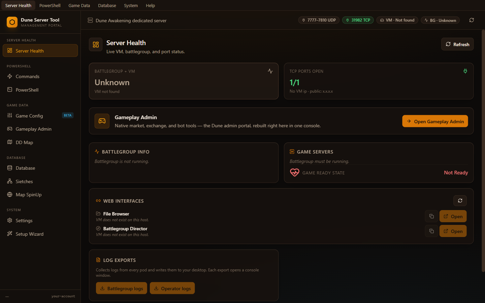
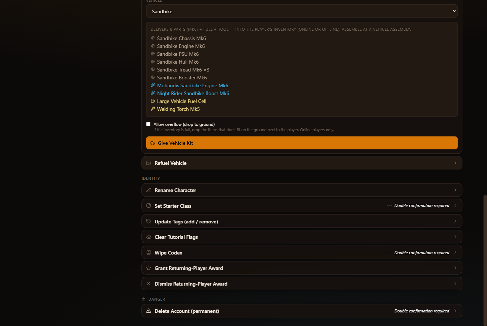
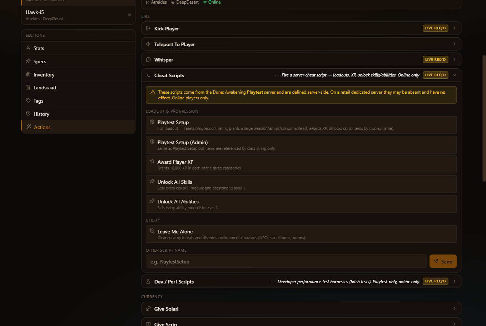
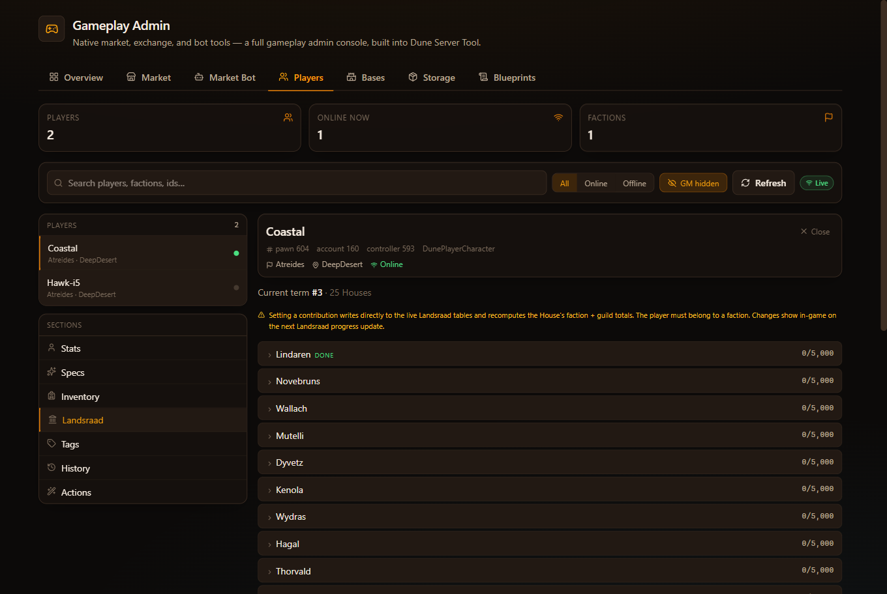
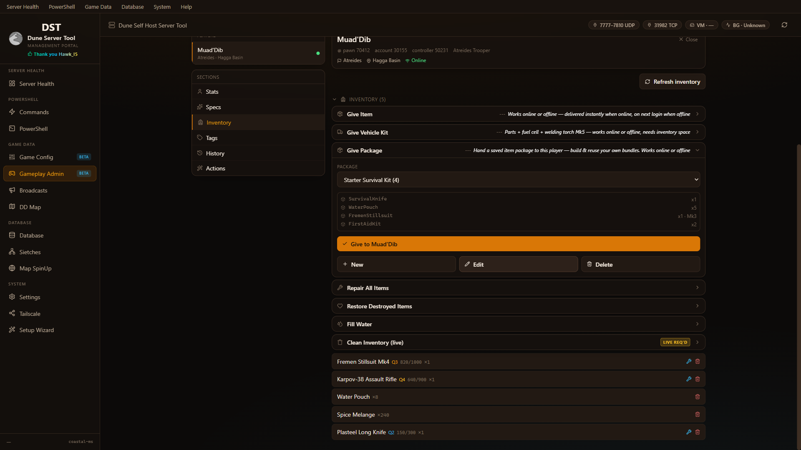
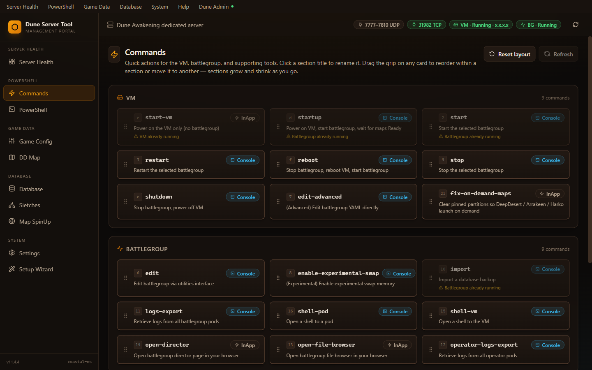
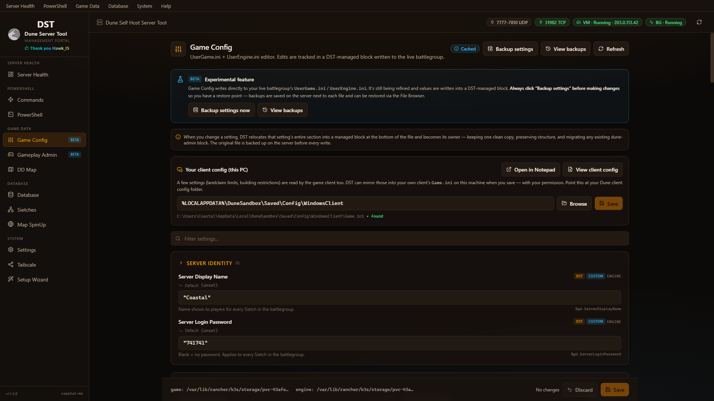
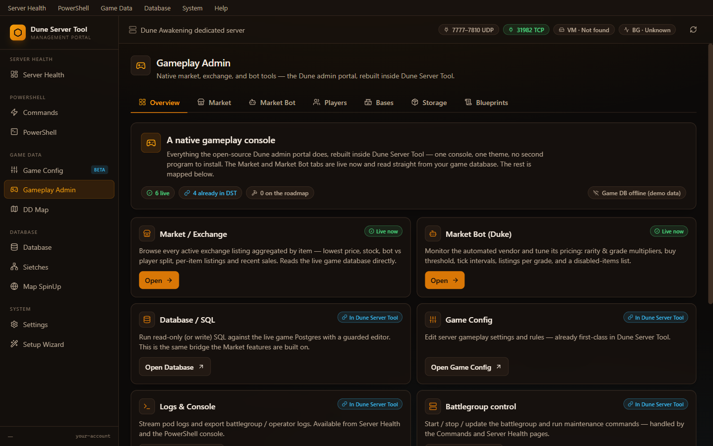
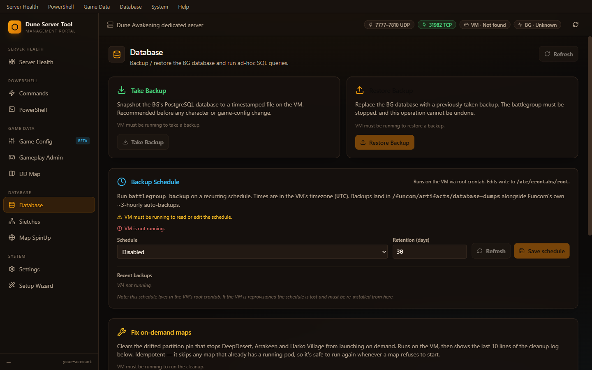
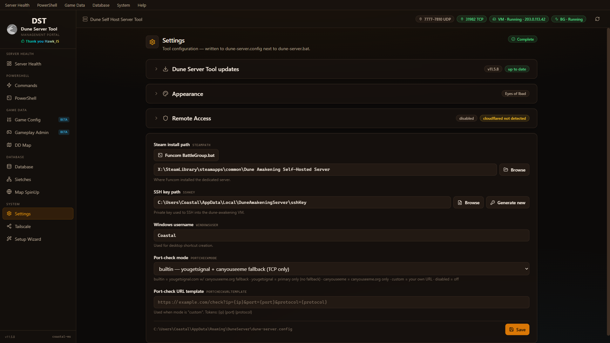

# DST - Dune Server Tool - For Dune: Awakening Self Hosted Servers
> By Coastal (Discord `@allcoast`). A Windows management portal for your
> self-hosted **Dune: Awakening** dedicated server — without ever opening a
> raw SSH shell or hand-editing YAML.

[](https://github.com/coastal-ms/DST-DuneServerTool/actions/workflows/lint.yml)
[](LICENSE)
[](https://github.com/coastal-ms/DST-DuneServerTool/releases/latest)

**🌐 Website & feature tour: [coastal-ms.github.io/DST-DuneServerTool](https://coastal-ms.github.io/DST-DuneServerTool/)** — screenshots, install guide, and the full changelog.

The current release is **v12.19.1**. The in-app version label and the
website show plain semver tags (e.g. `v12.19.1`) — the previous
Roman-numeral stylization has been removed.

> ## ✅ Confirmed compatible with Dune: Awakening **1.4.10.1**
> DST **v12.19.x** is verified working against the **latest Funcom release** —
> both the game **client** and the **self-hosted server** software — as of the
> **1.4.10.1** patch. Compatibility was checked live against a running
> self-hosted server on that build, covering battlegroup management,
> on-demand map spin-up, game-config and database editing, and backups.

It runs as a single-window Windows app (native WebView2 shell) that hosts a
local web portal (React + Vite + Tailwind) on `127.0.0.1` with a per-launch
tokenized URL. Same battle-tested SSH + Hyper-V + battlegroup automation
under the hood as the legacy CLI. Closing the app window stops the server;
the sidebar's **Web Portal** button hands the portal off to your default
browser and keeps the server running in the background.



### New in v12.19

- **Landsraad contributions now grant guild Voting Power** (v12.19.1, Players →
  Landsraad). Setting a player's House contribution now drives the game's own
  contribution pipeline instead of writing the totals directly, so the points
  cascade to the player's guild, refresh **Voting Power** live, and attribute
  to the guild's real faction — exactly like retail. This fixes guilds that led
  a House but stayed at 0 Voting Power and couldn't place a decree vote. (Once a
  guild casts its decree vote the game locks its Voting Power in — later
  contributions still complete Houses on the board but won't change a vote
  already cast; that's Funcom's own rule.)
- **Bases: Release / Destroy claim** (v12.19.0, Gameplay Admin → Bases). A new
  **Owner** column plus a guarded **Release claim** action (with a backup
  warning) frees a base's land claim by removing the totem; Funcom's cascade
  strips the claim, land segments, and every ownership grant in one
  transaction, and the building pieces remain as unclaimed structures. Restart
  the battlegroup for it to take effect in-game.

### New in v12.15–v12.18

- **VM memory-pressure diagnostics** (v12.18.0, Server Health). When a
  home-hosted VM runs low on RAM the kubelet OOM-kills Funcom's operator
  pods and Postgres, and the nightly backup stalls — a signature that
  previously took a log export to spot. A read-only probe now reads
  operator/DB pod restart counts and the VM's `free -h` / `/proc/meminfo`,
  and DST surfaces a red **"VM low on memory"** banner on Server Health,
  prints the same warning after Start / Reboot, and adds
  `vm-memory-pressure.txt` to the diagnostics bundle.
- **Remote-player game-UDP bridge — no more P34 on public-IP-only servers**
  (v12.18.0, Settings → Public IP / DDNS). Funcom's game pods bind the
  **public IP only**, so a router forwarding game UDP (7777–7810) to the
  VM's LAN IP hits no listener and remote players time out with P34. DST
  now installs and *persists* an iptables DNAT bridge
  (`LAN-IP:7777-7810/udp → public IP`) across the Public IP apply, the boot
  script, and the every-minute self-heal watchdog. It is **bind-detected**
  so it can't reintroduce the same-LAN black-hole removed in v12.16.9 —
  installed only when the game binds public-only, removed when it binds the
  LAN IP/wildcard. Live-verified by `tcpdump`.
- **Grant Cosmetics surfaces the full skin-variant catalog** (v12.18.0,
  Players → Items). The picker now buckets the entire `*_Variant` cosmetic
  family — **22 vehicle skins**, **37 weapon skins** (previously zero), and
  armor/suit variants — not just the three sandbike meshes it used to match.
- **Save-guard no longer false-fires on stale ghost rows** (v12.18.0). The
  online-player check now mirrors Funcom's own `dune.is_player_offline()`
  (online only when the row isn't `Offline` **and** its `server_id` is in
  `dune.active_server_ids`), so the new `LoggingOut` grace state and orphan
  rows after a restart no longer warn "N player(s) online" with nobody
  connected.
- **Update Tags gets the real catalog typeahead** (v12.18.0, Players →
  Update Tags). The add-tag box now uses the catalog-backed picker instead
  of a hardcoded 5-item list, so real gameplay tags (e.g.
  `Journey.LandsraadContractsUnlocked`) autocomplete. The write path still
  posts the add/remove **delta** so the game's server-side unlock triggers
  fire.
- **On-demand map partition self-heal — spin-up race fixed** (v12.18.1).
  The autonomous `*/15` partition healer no longer resets an in-progress
  manual map spin-up: a pinned-but-pod-less map is recorded on first
  sighting and only cycled if it is *still* pod-less on a later tick. Dead
  pods are still healed immediately; live sessions are always skipped. A new
  `install-only` mode lets the on-VM automation refresh without touching any
  map, so a live server can update mid-session.
- **Battlegroup Info raw pane: no more drifted Status column** (v12.17.0).
  A server title with spaces or a comma (e.g. `Dune, my Arrakis`) used to
  shift the Status cell in Funcom's positionally-parsed raw output. DST now
  rewrites just that row from the Battlegroup CRD JSON, tagged
  `(DST-corrected)`, only when the text actually disagrees.
- **VM header + Public IP card no longer crash on multi-adapter VMs**
  (v12.16.12). `Get-DuneVmStatus` coerces the VM IP to a string, so a
  wrapping PSObject on multi-adapter hosts no longer renders `[object
  Object]` or throws React error #31.
- **SteamCMD orphan-workdir pre-flight** (v12.16.11, Commands →
  Battlegroup → `update`). An interrupted SteamCMD update leaves a
  root-owned download workdir that fails every retry with `state is 0x206`;
  DST now cleans it before invoking `battlegroup update`.
- **Restore Backup no longer needs the battlegroup stopped** (v12.16.11).
  Funcom's `battlegroup import` handles the full stop/swap/recover cycle
  itself, so both the Database page and the Commands `import` entry now
  require only that the VM is running.
- **Grant All Skills reworked** (v12.16.9–v12.16.10). Now grants every
  skill at its real max level (EXPERIMENTAL badge removed), while leaving a
  small skill-point buffer and a 100 Intel floor so the tutorial's "learn
  an ability" step isn't soft-locked.

### New in v12.14.x

- **Server browser Ping fix** (v12.14.7, Commands page). New card at the
  top of Commands reconciles `HOST_DATACENTER_ID` on all three utility
  pods (director / serverGateway / textRouter) with the VM's Linux
  hostname. Vendor default is `dune-testing`, which doesn't match, so
  the in-game **Ping** column shows `0` with empty bars. Live-verified
  fix: patching to `duneawakening` (the DST-shipped Alpine VM hostname)
  and restarting the battlegroup flips Ping from `0` to a real value
  with full bars. The card pre-populates the datacenter-ID input with
  the detected VM hostname and the IP input with DST's current public
  IP; one Save patches the CR and issues a clean BG restart so FLS
  re-registers on the next matchmaker cycle. Save runs even when values
  are unchanged (repair use case). Live elapsed timer + expected-
  duration banner so operators can see progress during the ~1–3 minute
  restart. Distinct from the P34 / connection-joining diagnostics in
  Settings — this is only about the Ping value shown in the server
  browser.
- **Prune accumulated Completed database-backup dump pods** (v12.14.7,
  Database → Backup Schedule). Funcom's `battlegroup backup` job creates
  a one-shot `*-dump-YYYYMMDD-HHMMSS-pod` per run that terminates
  Succeeded and is never garbage-collected — they pile up on the Pods
  page and in the shell-pod picker. New section on the Backup Schedule
  card with **Keep last (count)** and **Keep last (days)** thresholds
  persisted into the managed crontab block, a **Save retention** button,
  and a **Prune now (N)** action with an enumerated-pod table showing
  owner references. Auto-prune also runs on every backup-schedule cron
  tick and as a post-action hook on Start All / Reboot All, so
  accumulation stays bounded on its own. Two-pass delete (graceful →
  force with `--grace-period=0`) surfaces any survivors with their
  owner controller.
- **Client `Game.ini` changes now park in a DST managed block**
  (v12.14.7, Game Config → Apply to client). The server-side files
  (`UserGame.ini`, `UserEngine.ini`) have always relocated DST-touched
  sections into a marker-delimited block at the bottom so operators can
  copy-paste the DST section to share with players connecting to their
  server. The local client `Game.ini` now uses the same writer path —
  every DST-touched section moves below the `; ===== Dune Server Tool
  (DST) managed section BEGIN =====` marker; unrelated user sections
  (audio, video, etc.) stay where they were.
- **Public IP apply now streams live progress during BG restart**
  (v12.14.7, Settings → Public IP / DDNS). The "Propagate IP to
  battlegroup + restart" step used to run one silent SSH script for
  5–7 minutes. Now split into three phases with a PowerShell-side wait
  loop that heartbeats the UI every 5 seconds — the step detail ticks
  `Waiting for servers to report ready… (3/60, up to 300s)` instead of
  sitting on a static label.
- **Establish faction membership for unaligned players** (v12.14.3). **Set
  Faction Tier** / **Give Faction Rep** now join an unaligned character to
  the faction in one offline action: complete the `DA_FQ_ClimbTheRanks`
  recruitment journey, apply faction/dialogue/contract tags, create the
  `FactionPlayerComponent` entry, and set the tier/reputation. Already-
  aligned characters are routed to **Reset Faction** first, then re-run.
- **Reset Faction** (v12.14.1–v12.14.2, Players → Progression). One
  offline action wipes a player's faction so they can start fresh —
  zeroes Atreides + Harkonnen rep in **both** the `player_faction_reputation`
  table *and* the runtime-read `FactionPlayerComponent`, clears alignment,
  removes faction tags, and resets the recruitment journey nodes so
  faction quests (including meeting the recruiters) can be replayed.
  Double-acknowledged.
- **Grant Cosmetic / Variant** (v12.14.1, Players → Items). Browsable,
  searchable picker for ~269 cosmetic unlockables — appearance set
  variants, colour swatches, and vehicle skins — that aren't in the
  standard Give Item catalog. Delivers the unlock via the existing
  give-item path.
- **Grant Building Sets** (v12.14.4–v12.14.5, Players → Items). Picker
  covers **all 225 learnable building sets** (223 grantable) — base-game
  Atreides/Harkonnen/Choam, crafting stations & utilities, faction/house
  sets, statues & decor, themed furniture, plus the original MTX
  Twitch-drop, collab, and movie-tie-in sets (137 items). The grantable
  set is authoritative: the union of every building-recipe item form in
  the game data and the distinct sets actually learned on a live server.
- **Players page keeps your place after grants** (v12.14.5). Granting an
  item / cosmetic / set / currency / tag now keeps the form open and
  preserves the selected player and scroll position; the list refresh is
  deferred until you collapse the action, switch player/section, or hit
  Refresh. (Per-item Repair/Delete still re-read inventory immediately.)
- **Full gameplay-tag catalog in the Tags editor** (v12.14.0). The
  typeahead searches ~3,600 real tags extracted from the live server
  image (engine-internal cues/combat/camera dropped) instead of a
  curated ~400 subset. Completable journey nodes are flagged with a
  "node" badge.
- **Item names refreshed for Funcom patch 1.4.10.0** (v12.14.0). Labelled
  the in-use templates that were missing from the catalog (T6 light
  ornithopter modules, Cutter, ContractItem).
- **Mobile companion: Players Online count matches the desktop**
  (v12.14.6). The mobile filter mirrors the desktop's case-insensitive
  helper verbatim, so the mobile Server State card no longer shows
  "Players Online (0)" when the desktop correctly lists connected
  players. **Server State card sums players across all game servers**
  per battlegroup so multi-shard hosts see the true total.
- **Treadwheel vehicle kit + catalog** (v12.14.1). The Treadwheel Hull
  modules (Mk1–Mk6) are now giveable, and the Give Vehicle Kit entry
  hands over all nine modules at Mk6 (Swift Engine + Steady Boost
  uniques, plus standard Chassis, Generator, Hull, Inventory, two Treads
  matching the vehicle's two wheels, Passenger, Scanner).

### New in v12.13.x

- **Restore warns about cross-server restores** (v12.13.17). Characters
  are bound to Funcom accounts in the cloud, so restoring a backup onto
  a *different* VM/battlegroup recovers the world and bases but may not
  restore character logins (they can fail to load or get cleared on
  boot). The Restore card and its confirmation prompt now say so —
  restore is intended for the same server.
- **Server rename works again** (v12.13.16). Game Config → Server name
  no longer rejects a valid name with "A non-empty name is required" —
  the request-body reader now handles hashtable-parsed bodies, so the
  rename + restart applies as expected.
- **Auto-clear of on-demand map partitions at battlegroup start works
  again** (v12.13.15). The post-restart hook now points at the bundled
  installer that replaced the removed `dune-clear-partitions.start`
  script, so DeepDesert / Arrakeen / Harko Village spawn promptly after
  a restart again.

### New in v12.2.1

- **Give Vehicle Kit now hands over the correct parts.** The kit contents were
  fixed so each vehicle actually assembles: **Sandbike** Tread ×3; **Buggy**
  Tread ×4 plus the Focused Buggy Cutteray Mk6; **Sandcrawler** swaps the base
  Tread for Dampened Sandcrawler Treads ×2; the **Scout / Assault / Carrier
  Ornithopters** swap their generic Wing for the named Albatross ×4 / Hummingbird
  ×6 / Roc ×8 wing modules (Carrier also gains Tail Hull ×2 and Side Hull ×2).
  The form preview now shows per-part quantities.

  

- **"Allow overflow (drop to ground)" toggle on item & kit gives.** A new
  checkbox on the Give Item and Give Vehicle Kit forms skips DST's
  inventory-capacity guard, so a full backpack no longer blocks the give — the
  game's native command drops whatever doesn't fit on the ground next to the
  player. Online players only (offline SQL gives can't drop to ground, so the
  flag is ignored there).

- **Cheat Scripts panel (Players → Live).** One-click buttons fire the named
  server cheat scripts for an online player — Playtest Setup, Award Player XP,
  Unlock All Skills / Abilities, Leave Me Alone — plus a freeform box for any
  other script name. Developer performance harnesses (Start / Stop Hitch Test)
  sit on a separate **Dev / Perf Scripts** row. Both carry a disclaimer that the
  scripts originate from the Playtest server and may have no effect on a retail
  server.

  

- **Landsraad Game Config edits keep the whole settings struct.** Editing a
  Landsraad value used to seed a minimal `Data=(...)` that dropped the board
  layouts, messages, and contract settings the game needs. DST now seeds the
  full default struct first and edits members in place — and *heals* legacy stub
  boxes written by older builds, restoring the ~35 missing members. Game Config
  also now **warns when your client's settings block is incomplete** (some
  members present, some missing) and "Fix my client config" rewrites the whole
  block.

### New in v12.2.0

- **Game Config now reads & writes every setting in the right INI section.** A
  value that lived in a different section than DST expected used to show as the
  Funcom default and edits could silently fail to apply. DST now reflects the
  real INI value and guarantees each setting lives in exactly one section — so
  toggles actually take effect and resets are consistent.
- **New Game Config sections:** **Landsraad**, **Hydration**, **Loot & Death**,
  and **Encounters** — plus many more real toggles in Storm Cycle, Spice,
  Sandworm, and Survival. The Landsraad settings live inside Funcom's single
  nested config struct; DST edits each one in place and preserves everything
  else, and mirrors them to the client too.
- **Players → Landsraad section** — set any player's contribution to any Great
  House (e.g. House Ecaz) to an arbitrary amount; faction + guild totals are
  recomputed automatically.

  
- **Per-item water editor** on Players → Inventory for water containers
  (literjons / canteens).
- **Per-field "Default" button** on every Game Config setting — resetting
  *removes* the key from the INI instead of writing the default, keeping files
  clean. The "apply to my client" flow shows an **Add / Update / Remove** badge
  per setting.
- **Manual-only backups** (no more a-backup-on-every-save pile-up) plus
  **multi-select delete** in the View-backups dialog.
- **Removed the 8 global multiplier options** (Health, Damage to NPCs/Players,
  XP, Progression Speed, Fame, Harvest Amount/Health) after **live in-game
  testing proved they do nothing** on self-hosted — the engine accepts the keys
  but no gameplay system reads them, and they aren't in Funcom's stock config.
  Building Damage and Inventory Weight multipliers are kept.

### New in v12.0.20–v12.0.24

- **Help → Show / Hide backend console** (v12.0.24) — the first UI path that
  un-minimizes and restores the backend PowerShell console window once tray
  mode has hidden it. Backed by a new loopback-only `/api/console` route that
  calls `ShowWindow(SW_RESTORE)` + `SetForegroundWindow`. The menu label
  tracks the real window state (refreshed when the Help menu opens), so it
  correctly reads "Show backend console" whenever the window is hidden *or*
  minimized to the taskbar.
- **Add Item search** (v12.0.20) — the picker's results popup now scrolls
  correctly to the last match (was clipped behind the next section before, so
  later catalog rows were unreachable) and the catalog gained **552 missing
  templates** (1294 → 1846 entries). Raw resources like **Spice Sand**,
  **Water**, and **Plant Fiber**, plus many garments, vehicle modules,
  weapons, and components, are now searchable and giveable.
- **Website link** in the menu bar (v12.0.22) — a right-aligned "Website"
  item opens the project's marketing site in your default browser.

#### Fixes

- **Console window no longer flashes during dashboard polling** (v12.0.23).
  The battlegroup-status probe (`Get-DuneBattlegroupSnapshot`) and the setup
  preflight SSH-key check both used to shell out via `& ssh ... 2>$errFile`,
  which silently allocated a fresh conhost window for every spawn when the
  caller was a background runspace whose parent's hidden console handle
  wasn't inherited. With multiple dashboard panels polling at 10–15 s, that
  produced a steady stream of brief console flashes on top of every other
  window. Both call sites now route through a new `Invoke-DuneSshHidden`
  helper (sibling of `Invoke-V6Ssh`) using `ProcessStartInfo` with
  `CreateNoWindow = $true`.
- **Market Bot** (v12.0.20–v12.0.21) — fixed `dune_exchange_orders_access_point_id_fkey`
  foreign-key violation when enabling the bot or clicking **Seed Market** on
  servers with no bot orders yet (fresh battlegroups, or upgrades from
  pre-`dune-admin`-removal builds). Access-point resolution now cascades
  through the authoritative `dune_exchange_accesspoints` table at every
  tier. Stackable raw resources (e.g. **Plastone**, **Plastanium Ingot**)
  now list in their full catalog stack instead of single-item listings, and
  a new opt-in **displayed-Solari-price cap** lets you clamp listing prices
  below the implicit `item_price × 10` ceiling.

### New in v12.0.19

- **Give Package — build your own item bundles.** Create named **item
  packages** (any mix of items, each with a quantity and tier Mk1–Mk6), then
  hand a whole package to any player in one click from the player's Inventory
  section. Packages are created, edited, and deleted right from the form and
  saved server-side (`item-packages.json`), so they persist across restarts and
  are shared between the desktop app and the remote portal. Delivery uses the
  normal give-items path, so it works **online or offline** as long as there's
  inventory space.

  

- **Give Vehicle Kit — a whole vehicle, no live spawn required.** Pick one of
  the six CHOAM vehicles that have craftable part items (Sandbike, Buggy,
  Sandcrawler, and Light/Medium/Transport Ornithopters) and DST drops its full
  **Mk6 part set** — chassis, engine, PSU, hull, locomotion, boost — **plus 1
  Large Vehicle Fuel Cell and 1 Welding Torch Mk5** straight into the player's
  inventory. Each kit also includes the vehicle's **named/unique top-tier
  modules** (e.g. Mohandis engine, Night Rider boost, Albatross/Hummingbird/Roc
  wings) and the **Scout Ornithopter Storage Mk4** (Light) / **Assault
  Ornithopter Storage Mk5** (Medium). The form previews the exact parts before
  you hand them over, and it works **online or offline** as long as there's
  inventory space — no live RMQ spawn. (Tank / Treadwheel / Container have no
  discrete part items in the game, so they stay on the live **Spawn Vehicle**
  action.)

  

- **Spawn Vehicle** action — spawns any of the nine CHOAM vehicles on the
  selected online player, with an optional tier-template loadout (e.g.
  *T6_Combat*, *T5_Inventory*) and a *Persistent* toggle.
- **Give whole tier set (Mk1–Mk6).** When the selected item is gradeable gear
  (weapon, armor, stillsuit, augment), one click hands it over at every grade
  Mk1 through Mk6 — online (instant) or offline (on next login).
- **Full gradeable-gear catalog (~1.3k entries).** Every gradeable weapon,
  garment, augment, and schematic is now searchable and tier-set-giveable from
  the Add Item / Give Item picker, each tagged with its `gradeable` flag and
  base `tier`.
- **Apply Quick Preset** action — completes a whole story/journey chapter in one
  click from a dropdown (Skip NPE, A New Beginning, Find the Fremen, All of Act 1,
  Unlock All Lore, and the Vermillius/Deep Desert/Taxation/Overland skips).
  Applies by account id, so it works online or offline.
- **Stop VM Only** command — powers off just the VM for maintenance; while a
  battlegroup is live it steers you to **Stop Full Stack** for a graceful
  shutdown instead.
- **Fixes:** bulk give (incl. Give Package) now lands on **online** players, not
  just offline ones; the give-items handler no longer crashes with "Argument
  types do not match"; Server Health no longer goes stale while the app is left
  open (polling now refreshes on tab visibility / window focus); and Apply Quick
  Preset now actually completes its nodes.

### New in v12.0.0

- **full Gameplay Admin build-out.** the Gameplay Admin portal lives
  natively inside DST as the **Gameplay Admin** tab — 54 player-management
  endpoints (currency, faction rep, char XP, items, vehicles, teleport,
  progression, contracts, jobs, codex, storage), an RMQ-backed
  `ServerCommand` channel with 11 live online-player handlers, a typed
  TypeScript client for every endpoint, and a bucketed **Actions** panel
  grouping all 28 player actions by intent (Lifecycle / Communication /
  Inventory / Progression / Punishment / Diagnostics).
- **Players tab polish.** A **Hide GM** toggle (Eye / EyeOff,
  localStorage-persisted) filters the GM player out of the list, the
  Online / Faction StatCards, and the Server Overview bucket counts in one
  click. Three new ways to deselect a player and return to Server Overview:
  click the selected row again, press Escape, or hit the new X Close
  button on the player card header. The **Items** actions (Give Item,
  Repair Equipped Gear, Fill Water, Clean Inventory) moved into the
  Inventory section so they sit between the player's name and inventory
  list rather than buried in a separate group.
- **Market + Market Bot.** **Seed market** bulk-lists every catalogued
  template across all 6 quality grades in one shot, with live progress
  bar, abort button, and bulk INSERT chunking that survives huge catalogs
  on the Windows argv limit. A 15s TTL cache on enriched listings kills
  sort lag, **Clear Duke listings** wipes orphan inventory rather than
  just the referenced ones, and a configurable per-template `price_floor`
  (default 50) keeps the bot from listing trivially-priced items.
- **Installer migration.** Upgrading from pre-12.0.0 wipes the legacy
  per-user autostart scheduled tasks (`\Dune Server\DuneServer-Autostart-<sid>`),
  but later v12.0.x → v12.0.y in-app updates preserve your autostart
  preference.

### Carried forward from v11

- **All default settings browser (Game Config).** A collapsible *All
  default settings* card reads the battlegroup's live `DefaultGame.ini` and
  `DefaultEngine.ini` from a running game-server pod and merges them with
  your `UserGame.ini` / `UserEngine.ini` overrides — every section is
  expandable, every key gets a type-aware editor, overrides are badged, and
  changes are saved through the existing managed-block writer (with a
  `.dstbak-<ts>` backup).
- **Risk-acknowledgement modal on Game Config.** A *"Use at your own
  risk"* modal greets first-time visitors to Game Config (and re-prompts
  once after every DST update) so a bad edit isn't a silent footgun.
- **Theming engine.** A Settings → **Appearance** card with six built-in
  presets — Eyes of Ibad, Sietch Tabr, Caladan, Giedi Prime, House Harkonnen,
  and Atreides — plus per-token color customization, JSON import/export, and
  live recoloring of the in-app terminal. Your choice is persisted locally and
  applied before React mounts (no flash of the default theme on launch).
- **PowerShell page is loopback-only.** The free-form terminal is hidden, and
  refused server-side, for any viewer that isn't on the host machine itself.
- **Run at Windows startup.** An opt-in **Help → Run at Windows startup**
  toggle keeps the server alive in the tray across sign-ins.

See [`CHANGELOG.md`](CHANGELOG.md) for the full release history and
[`CONTRIBUTING.md`](CONTRIBUTING.md) for the change-control workflow.

### License & attribution

DST is released under the **Apache License 2.0** (see [`LICENSE`](LICENSE)
and [`NOTICE`](NOTICE)). You're welcome to use it, fork it, modify it, and
redistribute it. If you do redistribute or build on top of it, the license
requires you to preserve the `NOTICE` file and credit **Coastal** (Discord
`@allcoast`, project home <https://github.com/coastal-ms/DST-DuneServerTool>)
as the original author. Republishing this tool as your own work without
attribution violates the license — please don't.

---

## Quick install

1. Download **`DuneServerSetup.exe`** from the
   [latest GitHub release](https://github.com/coastal-ms/DST-DuneServerTool/releases/latest).
2. Double-click. The installer walks you through it (one UAC prompt — Hyper-V
   needs admin). The Start Menu shortcut and the launcher EXE are placed in
   `C:\Program Files\Dune Server\`.
3. Launch from **Start Menu → Dune Server**. The launcher binds a free local
   port (47823+), opens the **Dune Server Tool** native app window
   (WebView2) pointed at `http://127.0.0.1:<port>/?t=<token>`, and runs a
   minimized PowerShell console in the background. The first launch opens
   the **Setup Wizard** page, which asks for your server install folder
   and SSH key. All answers are saved to `%APPDATA%\DuneServer\` and
   preserved across reinstalls.

> The launcher is single-instance — clicking the desktop shortcut again just
> focuses the existing app window. No duplicate UAC prompt, no second window.

> 🌐 **Web Portal button** — the sidebar's **Web Portal** button (footer of
> the left nav, visible only inside the app window) hands the portal off to
> your default browser: it opens the tokenized URL in Chrome/Edge/Firefox,
> closes the app window, and **keeps the server running in the background**.
> Reopen Dune Server Tool any time to bring the app window back — the prior
> background server is stopped and a fresh one is started (one UAC prompt).

---

## What you need

- **Windows 10/11** with **Hyper-V** enabled (Pro / Enterprise / Education).
- **PowerShell 7** (`pwsh`) — [download](https://github.com/PowerShell/PowerShell/releases). The launcher prompts you with this link if it's missing.
- **Microsoft Edge WebView2 Runtime** — ships with Windows 11 and modern
  Windows 10; the installer falls back to your default browser if it's
  missing. The native app window uses WebView2; the **Web Portal** button
  hands off to a standalone browser tab whenever you prefer one.
- **Dune: Awakening Self-Hosted Server** installed via Steam (gives you the
  `battlegroup-management` folder and the Hyper-V VM image).
- **SSH private key** for connecting to your VM — created automatically
  during Funcom's official self-hosted setup; usually in
  `%LOCALAPPDATA%\DuneAwakeningServer\sshKey`.

---

## The portal — a page tour

The window is split into a **left nav rail** (grouped under Server Health,
PowerShell, Game Data, Database, and System) and a **page surface** on the
right. The persistent **header status bar** at the top shows live VM /
battlegroup / port status, a **Refresh** button, and a prominent red **Shut
down** button that gracefully stops the local `DuneServer.exe` portal process.

### 🩺 Server Health


The default landing page. Cards for everything you usually want to glance at:

- **Battlegroup + VM** — combined running / stopped state and uptime.
- **TCP Ports Open** — live verdict for each public TCP port (Game first,
  Game last, RabbitMQ).
- **Battlegroup Info** — typed view of `kubectl get bg` (BG state, DB,
  Gateway, Director, Uptime). **BG state** reports a green **Healthy** while
  the operator is healthy *or* reconciling (the operator's normal steady
  state), so yellow/red only show for genuine transitions or faults; a
  per-visit **Show raw output** toggle reveals the raw `battlegroup status`
  text on demand.
- **Game Servers** — per-pod phase, readiness, player count, age.
- **Active Spice** — per-map / per-size-class active vs primed counts,
  pulled live from `dune.public_spicefields` over psql. Tiered colors
  (Large = amber, Medium = blue, Small = muted) and at-cap highlighting.
  Each row also has an **Active** checkbox (v6.1.30+) that toggles
  `dune.spicefield_types.is_spawning_active` live — clicking commits
  immediately through a guard-railed endpoint that only ever writes
  `TRUE`/`FALSE` to that single column. One shared 5-second click
  cooldown across all checkboxes prevents accidental DB hammering
  (live `(Ns)` countdown shown next to the disabled row).
- **Public Port Status** — open / closed / skipped badges for Game (UDP)
  and RabbitMQ (TCP), with a primary + fallback port-check provider.
- **Web Interfaces** — one-click launchers for File Browser and
  Battlegroup Director (URLs visible and copyable).
- **Log Exports** — pull logs from any pod or the operator with one click.

Per-map spin-up / shut-down controls for Deep Desert, Arrakeen, and Harko
Village live on the dedicated **Map SpinUp** page (see below).

### ⚡ Commands



Quick-action cards grouped by **VM**, **Battlegroup**, and **Tools**. Each
card shows whether the command runs **InApp** (in the embedded terminal)
or **Console** (in a popup window for interactive commands). Click the
keyboard hint to fire the card; cards self-disable with a hint when the
action wouldn't make sense right now (e.g. *start* greyed out with
"Battlegroup already running").

Drag the grip on any card to reorder commands within their section — the
order auto-saves to `%APPDATA%\DuneServer\button-order.json` and persists
across launches. The header has a **Reset layout** button to revert to
the default arrangement.

### 🖥️ PowerShell

Embedded PowerShell session backed by xterm.js. Runs locally on your
Windows host — use it for `kubectl`, `ssh dune@vm '...'`, and other
one-shot commands. Persistent working directory across commands. Each
WebSocket session owns a dedicated runspace; **Cancel** stops the current
command, **Clear** wipes the buffer, **Reconnect** spins up a fresh
runspace. Note: this is an exec model, not a real PTY — `vim` and `htop`
won't work, but everything else does.

**Loopback-only.** Because this page runs arbitrary commands as the
DuneServer service user on your host, it's hidden from the nav for any viewer
that isn't on the host machine itself, the `/terminal` route redirects them to
Server Health, and the `/ws/terminal` socket is refused server-side for
non-loopback callers. The curated **Commands** page stays available either way.

### ⚙️ Game Config



A grouped editor for `UserGame.ini` and `UserEngine.ini`, with every
setting labeled, typed, and showing its underlying key in fine print.
Groups: Server Identity, Combat Rules, World & Weather, Shai-Hulud,
Resources & Loot, Players, Spicefields, Performance, and more. The page
**scans the live INIs on load** and shows each setting's **Funcom default**
until you override it; your edits are written into a clearly-marked
**DST-managed block** that DST owns (whole-section relocation, dedup, and
migration of any legacy Gameplay Admin block), and the original file is **backed
up on the server before every write**. A reminder prompts you to
hit **Backup settings** first — and a **View backups** button lists the recent
`.dstbak-*` restore points next to each file. Save flushes the files back to
the VM and invalidates the Server Health port cache so any port change is
reflected immediately.

### 🎮 Gameplay Admin



The open-source **Gameplay Admin portal, rebuilt natively inside DST** — one
console, one theme, no second program to install. A tabbed surface
(**Overview, Market, Market Bot, Players, Bases, Storage, Blueprints**) sits
on top of the same SSH + psql bridge the rest of DST uses, and v12.0.0
completes the port:

- **Market / Exchange** aggregates every active listing by item (lowest
  price, stock, bot vs. player split, recent sales). The enriched list is
  cached for 15 seconds so sort/filter on big catalogs stays instant.
- **Market Bot ("Duke")** both *buys* player listings and *lists* its own
  NPC stock. Two pricing modes, switchable from a header tile:
  - **Sane** (default): tier × category × rarity × vendor × grade with a
    100,000 Solari hard cap and a vendor floor — same shape DST has
    shipped since 12.0.
  - **Upstream**: the Funcom-style formula from the pre-sane-pricing
    reference implementation — uncapped tier tables
    (T0:500 → T6:750,000 equipment, T6:75,000 schematics, per-unit
    stackables), rarity × grade multipliers, vendor × rarity-mult when
    the item has a vendor price. Toggling either direction wipes Duke's
    existing listings after a confirm so the new prices repopulate on
    the next list tick instead of churning.

  Per-template overrides (with an inline typeahead picker) win in both
  modes. Three sub-tabs (**Buy / List / Pricing rules**), a
  vendor-snapshot preview, per-actor-class listing breakdown, and a
  one-click **Clear listings** that wipes Duke *and* any leftover Revy
  rows from the old external Go market-bot in a single sweep — player
  listings are never touched.
- **Seed market** bulk-lists every catalogued template across all six
  quality grades in one shot with a live progress bar, abort button, and
  bulk-INSERT chunking that survives huge catalogs.
- **Players** ships the full 54-endpoint admin surface: a bucketed
  **Actions** panel covering all 28 player actions (Lifecycle /
  Communication / Inventory / Progression / Punishment / Diagnostics), a
  **Hide GM** toggle that filters the GM out of the list *and* the
  Online / Faction StatCards and Server Overview bucket counts, the
  **Items** actions (Give Item online + offline-safe, Repair Equipped
  Gear, Fill Water, Clean Inventory) folded into the Inventory section
  between the player's name and item list, and three ways to deselect a
  player (click the row again, Esc, or the new X Close button) to return
  to Server Overview.

When the battlegroup is offline the page falls back to a realistic **demo
dataset** (clearly badged) so the tools are explorable out of the box and flip
to live data automatically once the battlegroup is running.

### 🗄️ Database



- **Take Backup** / **Restore Backup** for the BG PostgreSQL database
  without remembering pod names. A banner reminds you to stop the BG
  first for a consistent backup.
- **Backup Schedule** (v10.1.8+) — install a recurring `battlegroup backup`
  cron on the VM directly from the UI, with optional auto-pruning of dump
  files older than N days. Presets cover hourly, every six hours, daily 04:00,
  twice daily (04:00 and 16:00), and weekly Monday. The schedule lives in a
  clearly-marked managed block inside root's `/etc/crontabs/root`, is read
  back and verified after each save, and is shown alongside recent backup
  files plus a tail of `/var/log/dune-backup.log`. If a hand-installed
  `battlegroup backup` cron already exists (e.g. the legacy `0 4 * * *` line
  from the backup guide), the card preselects the matching preset and a
  single Save migrates it into the managed block — without leaving duplicate
  schedules behind. Backups land in `/funcom/artifacts/database-dumps/<bg>/`
  alongside Funcom's own ~3-hourly auto-backups. The schedule lives on the
  VM, so reprovisioning the VM loses it and it must be re-installed from the
  card.
- **Fix on-demand maps** (v10.0.4+) — one click clears the drifted
  `igwsss.spec.partitions` pin that intermittently stops DeepDesert,
  Arrakeen and Harko Village from launching on demand, then shows the last
  10 lines of the cleanup log inline. Idempotent and skips any map that
  already has a running pod, so it's safe to run repeatedly. Also available
  as the **fix-on-demand-maps** card in the Battlegroup section of the
  Commands page and the CLI Battlegroup menu.
- **SQL Editor** powered by Monaco. Read-only by default; toggle the
  switch to enable writes. Filterable table list sidebar, configurable
  max-rows cap, **Ctrl+Enter** to run.

### 🕸️ Sietches *(experimental)*

Experimental page for adding or removing additional Survival_1 shards
(sietches). Each sietch costs ~12 GB of RAM and requires the UDP port
range 7777–7900 to be open on the host. Gated behind an
**I UNDERSTAND** confirmation prompt — patches the battlegroup CRD
directly. Unsupported by Funcom; you're on your own if something breaks.

### 🗺️ DD Map

Two link cards (method.gg + dune.gaming.tools) for the interactive Deep
Desert maps the community maintains. Both target sites send
`X-Frame-Options: SAMEORIGIN`, so we can't embed them directly — clicking
**Open in new tab** launches each in your browser.

### 🌍 Map SpinUp

Per-map on-demand control for the three scale-to-zero maps — **Deep Desert**,
**Arrakeen**, and **Harko Village**. Each card shows the map's current pod
state with **Spin up** / **Spin down** buttons that patch the battlegroup's
`ServerSetScale` so the map comes up (or releases its RAM) without an SSH
session. Always-on maps (Hagga / Survival_1 and Overmap) are listed for
reference but not toggled here.

A header **Fix partitions** button clears the drifted
`igwsss.spec.partitions` pin that occasionally stops an on-demand map from
launching after a reboot, then shows the last ~10 lines of the cleanup log
inline. It's idempotent and skips any map with a running pod, so it's safe to
click repeatedly (the same action as the **fix-on-demand-maps** Command).

### 🔧 Settings



All the things the Setup Wizard asked you, but editable any time:

- Steam install path (where Funcom dropped the dedicated server)
- SSH key path (private key into the dune-awakening VM)
- Windows username (used for desktop shortcut creation)
- **Port-check mode** — `builtin` (yougetsignal + canyouseeme fallback),
  `yougetsignal` only, `canyouseeme` only, `custom` (your own URL), or
  `disabled`
- Port-check URL template (when mode is `custom`)

Changes save on-click — no restart needed. The Steam path and SSH key fields
each have a **Browse** button that opens a native Windows folder/file picker.

The Updates card lives at the top of the page (minimized by default and
auto-checks on mount):

- **Updates** — current vs. latest Dune Server Tool version pulled from
  the GitHub Releases API. **Check now** to refresh, **Install** to
  download `DuneServerSetup.exe` and launch the installer wizard
  (interactive — the running portal is killed by PID before the wizard
  copies files, and the wizard's *Launch Dune Server* checkbox handles
  the relaunch).
### 🧙 Setup Wizard

Six-step linear flow that runs automatically on first launch:

1. **Pre-flight** — admin check, Hyper-V module, disk space, OS, config
2. **Configuration** — confirm tool settings
3. **Installing** — import the Hyper-V VM
4. **Security** — SSH + firewall
5. **Networking** — ports + DNS
6. **Finalize** — wrap-up

Re-runnable any time from the nav rail for a clean reset.

---

## Where things live

| Item                           | Path                                                       |
| ------------------------------ | ---------------------------------------------------------- |
| Install dir                    | `C:\Program Files\Dune Server\`                            |
| Config / state                 | `%APPDATA%\DuneServer\`                                    |
| Setup config                   | `%APPDATA%\DuneServer\dune-server.config`                  |
| Commands layout                | `%APPDATA%\DuneServer\button-order.json`                   |
| Server log (taskbar console)   | `%LOCALAPPDATA%\DuneServer\dune-server.log`                |
| Last portal URL                | `%LOCALAPPDATA%\DuneServer\last-url.txt`                   |
| SSH key (created by Funcom)    | `%LOCALAPPDATA%\DuneAwakeningServer\sshKey`                |
| Start Menu shortcut            | *Start → Dune Server → Dune Server*                        |
| Live logs                      | Click the minimized **Dune Server** entry in your taskbar  |

Uninstalling removes the install dir but **never touches
`%APPDATA%\DuneServer\`** — your config is preserved if you ever reinstall.

---

## Auto-update

The portal polls the public GitHub Releases API on a 6-hour cadence (also
cached for 1h server-side). When a newer tag is published with an attached
`DuneServerSetup*.exe`, an amber banner appears above the status bar with
**Update now** / **Later** buttons. **Update now** downloads the asset to
`%TEMP%\DuneServerUpdate\` and launches the installer **wizard** — the
detached relauncher kills the current `DuneServer.exe` by PID, the wizard
walks through the standard pages, and the *Launch Dune Server* checkbox on
the Finished page brings the portal back up. As of v6.1.30 the relauncher
runs in a visible window (with a brief "Installing update..." banner) and
explicitly raises the wizard's main window so it appears in the foreground
instead of being hidden behind the browser or other windows. Your config
in `%APPDATA%\DuneServer\` is preserved across upgrades. As of v11.4.4 the
whole sequence is ~7–10s faster (lighter installer compression and trimmed
relauncher waits).

You can also check manually from **Settings → Updates → Check now**.

---

## Run at Windows startup *(optional)*

The **Help** menu (top toolbar) has a **Run at Windows startup** toggle.
Turn it on and DuneServer launches automatically every time you sign in to
Windows — in the system tray with no app window — and **closing the
DuneShell window no longer stops the server**.

- Reopen the portal any time from the **tray icon → Open Web Portal**, or
  just launch the Start Menu shortcut again (the running background server
  stays where it is; the shortcut brings the app window back).
- Toggling on or off takes effect at the **next launch**. Flipping mid-
  session doesn't change the current session's close behavior — that's
  intentional, so closing the app window always does what you just saw it
  do, not what a setting says it should do.
- **Loopback-only**: remote viewers (Tailscale / LAN / the SSH-tunneled
  co-admin pattern below) cannot enable autostart on your host. The menu
  entry is hidden for non-local viewers and the backend route refuses
  non-loopback callers.
- Implemented as a per-user Task Scheduler "at logon" job named
  `DuneServer-Autostart-<sid>` under the `Dune Server` folder. The
  uninstaller removes it automatically.

**Off by default — opt-in only.** If the toggle is missing from the Help
menu you're either viewing remotely (expected) or running from a dev
`pwsh` shell rather than the installed `DuneServer.exe` (also expected —
the feature needs the .exe path to schedule).

---

## CLI launcher *(`dune-server.bat`)*

The repo also ships a menu-driven PowerShell CLI for scripting one-off
commands without launching the portal (e.g. from a scheduled task). Clone
the repo (or download the source zip), then double-click `dune-server.bat`
or invoke it with `-Cmd <name>`:

```powershell
.\dune-server.bat              # interactive menu
.\dune-server.bat -Cmd version # print installed version
```

The portal and the `.bat` file both call into the same `dune-server.ps1`
business logic — they're not separate codebases.

---

## Remote access & Mobile App

DST ships with a **Mobile App** companion that lets you monitor server health, view live player lists, and manage basic gameplay admin directly from your phone.

Because the DST Desktop backend exposes full admin capabilities, it **strictly binds to 127.0.0.1 (localhost) and is never exposed on your LAN or the public internet.** To reach it from your phone (or a friend's browser), DST uses a **Cloudflare quick tunnel**: a small bundled `cloudflared` helper connects *outbound* from your PC to Cloudflare and hands back a temporary `https://<random>.trycloudflare.com` address. Nothing inbound is opened — **no VPN, no account, no domain, and no router port-forwarding.**

### Mobile App Setup

1. Open the **DST Desktop App** → **Settings → Mobile App**.
2. Click **Start secure tunnel**. DST launches the tunnel and shows a QR code.
3. Open the **DST Mobile App** and scan the QR code. (No camera? Tap **Enter Code Manually** and paste the URL + token shown.)

That's it — your friends need **nothing** installed on their phones. The loopback bridge that the tunnel points at is installed automatically and never leaves `127.0.0.1`.

> The quick-tunnel address changes every time the tunnel restarts. If you stop/start it, re-scan the QR code. For a **permanent** address (and email-gated access), see *Co-admin access* below.

### Co-admin access (a friend's browser)

A friend can reach your **web portal** the same way:

- **Free / quick:** start the secure tunnel and share the `https://…trycloudflare.com` URL + token. Anyone with the URL + token has full admin — share only with people you trust at that level.
- **Stable / gated (optional upgrade):** if you own a domain, point it at a Cloudflare **named tunnel** and enable **Cloudflare Access** so only specific email addresses can reach a fixed hostname (e.g. `dune.example.com`). Set the owner email and admin allow-list under **Settings → Remote Access**; DST gates `/api/remote/*` on the `Cf-Access-Authenticated-User-Email` header plus its per-launch token.

> **Note:** The built-in PowerShell terminal page inside the DST web UI is strictly refused over remote connections. It will only load if you are physically at the host machine using `127.0.0.1`.

---

## Remote access *(advanced — SSH Tunnel)*

DST binds its web portal to `127.0.0.1` only — there is **no** built-in
remote login, and exposing the port to the public internet would be unsafe
(the per-launch token is the only credential). If you want a trusted
co-admin to reach your portal from elsewhere, the supported pattern uses
only software that ships with Windows 10 / 11 — no Cloudflare, Tailscale,
ngrok, VPN service, or other third-party install required.

> ⚠️ **Read this first.** Anyone with your DST URL + token has full admin:
> they can restart your battlegroup, edit `ServerSetup.ini`, drop the
> database, or kick players. Only share access with people you trust at
> that level. The token resets on every DST launch and lives in
> `%LOCALAPPDATA%\DuneServer\last-url.txt`.

### How it works

The remote user opens an **SSH local port-forward** (a feature built into
`ssh.exe` on every Windows 10 / 11 install) that tunnels their machine's
`127.0.0.1:47823` to your machine's `127.0.0.1:47823`. They then browse to
the DST URL on their own loopback. The portal itself never accepts a
non-loopback connection, so it stays as locked down as if they were
sitting at your desk.

### One-time host setup (your machine)

1. **Install OpenSSH Server** (Microsoft component, no third-party install):

   ```powershell
   # Run as Administrator
   Add-WindowsCapability -Online -Name OpenSSH.Server~~~~0.0.1.0
   Set-Service -Name sshd -StartupType Automatic
   Start-Service sshd
   New-NetFirewallRule -Name 'OpenSSH-Server-In-TCP' -DisplayName 'OpenSSH Server (TCP)' `
     -Enabled True -Direction Inbound -Protocol TCP -Action Allow -LocalPort 22
   ```

2. **Force key-only authentication** — edit `C:\ProgramData\ssh\sshd_config`:

   ```
   PasswordAuthentication no
   PubkeyAuthentication yes
   PermitRootLogin no
   AllowUsers <your-windows-username>
   ```

   Then `Restart-Service sshd`.

3. **Add your co-admin's public SSH key** to your authorized list:

   ```powershell
   # If your Windows account is in the Administrators group:
   $key = 'ssh-ed25519 AAAA... them@laptop'   # paste their public key
   Add-Content -Path 'C:\ProgramData\ssh\administrators_authorized_keys' -Value $key
   icacls 'C:\ProgramData\ssh\administrators_authorized_keys' /inheritance:r `
     /grant 'Administrators:F' /grant 'SYSTEM:F'
   ```

   For a non-admin Windows account, use `C:\Users\<you>\.ssh\authorized_keys`
   instead (create the `.ssh` folder if missing; lock to user-only ACLs).

4. **Open a port on your router** — forward an arbitrary public TCP port
   (e.g. `52222`) → your PC's `22`. Use a non-standard external port to
   cut log noise from internet scanners. If your ISP gives you a rotating
   public IP, use a free dynamic-DNS hostname (e.g. DuckDNS, No-IP) — but
   that's still your DNS provider, not a tunnel service.

5. **(Recommended)** Rename the `sshd` Windows service log to flag brute
   force, or disable IPv6 on the router rule.

### One-time co-admin setup (their machine)

1. They generate a keypair on their Windows / macOS / Linux box:

   ```bash
   ssh-keygen -t ed25519 -C "them@laptop"
   ```

2. They send you `~/.ssh/id_ed25519.pub` (public key only — never the
   private one). You paste it into step 3 above.

### Every time the co-admin wants to connect

1. **You** launch DST normally, then send them the current token from
   `%LOCALAPPDATA%\DuneServer\last-url.txt` (it rotates on every launch).
   Use a secure channel — Signal, encrypted email, Discord DM — not a
   public channel.

2. **They** open an SSH tunnel from their machine:

   ```bash
   ssh -N -L 47823:127.0.0.1:47823 <your-windows-user>@<your-public-ip> -p 52222
   ```

   - `-N` = "don't run a remote command, just hold the tunnel"
   - `-L 47823:127.0.0.1:47823` = "forward my local 47823 to your loopback 47823"
   - Replace `52222` with whatever external port you forwarded on the router

3. **They** open the DST URL in their own browser, but pointed at *their*
   loopback:

   ```
   http://127.0.0.1:47823/?t=<token-you-sent-them>
   ```

4. When done, they `Ctrl+C` the SSH session to tear down the tunnel.

### Notes / gotchas

- **DST's port is dynamic.** It prefers `47823` but probes up to `+50`
  if busy. Check `%LOCALAPPDATA%\DuneServer\last-url.txt` for the real
  port and adjust the `-L 47823:127.0.0.1:<actual-port>` accordingly.
- **The DuneShell window holds the listener.** If you close it without
  using **Web Portal** (sidebar footer), the server stops and the
  tunnel returns 502s. Click **Web Portal** first if you want the
  server to keep running in the background after you close the window.
- **Token rotates on every DST launch.** If you restart DST while the
  co-admin is connected, re-send the new token from `last-url.txt`.
- **PowerShell page is loopback-only by design.** Even over the tunnel,
  the PowerShell terminal is intentionally restricted so a remote admin
  can't get a shell on your host. Server-side commands still work.

---

## Community & support

Join the **DST community Discord** for install/setup help, hosting and
networking questions, Game Config tips, release announcements, and general
chat with other self-hosters:

> 👉 [**Join the DST Discord**](https://discord.gg/tj2x7cywSC)

It's the best place for "how do I…" questions and hosting help. For anything
that needs a code fix, please still open a GitHub issue (below) so it's
tracked publicly.

---

## Reporting issues

Hit a bug, error, or unexpected behavior? **Please open a GitHub issue**
so it can be tracked and fixed:

> 👉 [**Open an issue**](https://github.com/coastal-ms/DST-DuneServerTool/issues/new/choose) &nbsp;·&nbsp;
> [Browse existing issues](https://github.com/coastal-ms/DST-DuneServerTool/issues)

The bug report form asks for:

- **Tool version** — shown in the portal footer (e.g. `v12.18.1 · coastal-ms`).
- **Surface** — which portal page (Server Health, Commands, PowerShell,
  Game Config, DD Map, Map SpinUp, Database, Sietches, Settings, Setup
  Wizard) or whether it was the CLI / installer / auto-updater.
- **Page / button / command** — the specific thing you clicked or typed.
- **Environment** — OS build, PowerShell version, browser.
- **Diagnostics** — recent lines from the server log
  (`%LOCALAPPDATA%\DuneServer\dune-server.log`).

The **Report Issue** action (CLI: `dune-server -Cmd report-issue`)
pre-fills most of this for you and opens the GitHub form in your browser.
**Sanitize first** — remove IPs, hostnames, usernames, and any key file
contents before submitting.

Quick questions are also welcome in the [DST community
Discord](https://discord.gg/tj2x7cywSC), but use the issue tracker for
anything that needs a fix — it keeps the history public so other admins can
find the same answer.

---

## Troubleshooting

### Players get P34 / "Connection Request Timed Out"
Your server is visible but players can't connect (or it dropped off the
browser). This is almost always in the network path, not the game server.
Start with **Settings → Public IP / DDNS → Connection check (P34)**, then see
the full guide: **[Troubleshooting P34](docs/troubleshooting-p34.md)** — it
covers private‑datacenter setups, port forwarding, NAT loopback (same‑network)
play, IPv6, double‑NAT/CGNAT, the "delisted but check green" case, and what's
Funcom‑side.

### "pwsh is not recognized"
PowerShell 7 isn't installed. Download it from
[github.com/PowerShell/PowerShell/releases](https://github.com/PowerShell/PowerShell/releases)
and install. The launcher and the `.bat` CLI both require `pwsh`, not the
built-in Windows PowerShell 5.1.

### Browser didn't open / portal tab is blank
The launcher writes the current URL to
`%LOCALAPPDATA%\DuneServer\last-url.txt` — open it manually if the
browser didn't pop. If the tab opens but shows "Invalid or missing
token", close it, then close & relaunch DuneServer.exe — that error
means you have a stale URL from a previous run.

### "The script requires administrator privileges"
Hyper-V cmdlets need admin. The installer enables this for `DuneServer.exe`;
for the CLI, right-click `dune-server.bat` → **Run as administrator**, or
click Yes on the UAC prompt.

### Server Health: Game Port lookup failed
The portal couldn't read `UserEngine.ini` from the VM. Common causes:

- VM is stopped (the header pill will show "VM stopped").
- SSH key path is wrong (check Settings).
- Battlegroup hasn't been started yet, so the INI doesn't exist.
- Open the Terminal page and run `ssh dune@<vm-ip> 'cat ...UserEngine.ini'`
  to verify SSH manually.

The cache TTL is 10 minutes; saving the Game Config page clears it
immediately.

### TCP Ports Open shows "unknown" for RabbitMQ
The primary port checker (yougetsignal.com) has a daily per-public-IP
rate limit. v6.1.5+ automatically falls back to canyouseeme.org when this
happens; if both are exhausted, try again tomorrow or switch to a single
provider via **Settings → Port-check mode**.

### Port check shows `[CLOSED]` but the game works
Many port-check services don't truly probe UDP — they report "closed"
when they really mean "no UDP response". Confirm with a UDP-aware tool
like `nmap -sU -p 7777 <public-ip>` from another network before assuming
your forwarding is broken.

### I want to start over
Open the **Settings** page and clear the fields you want re-asked, or
delete `%APPDATA%\DuneServer\dune-server.config` to re-run the Setup
Wizard from a clean slate. Your `button-order.json` and logs are kept.

---

## Build from source

You don't need to build DST to use it — grab the signed
[`DuneServerSetup.exe`](https://github.com/coastal-ms/DST-DuneServerTool/releases/latest)
from Releases. This section is for contributors and anyone who wants to verify
what the release binary is built from.

**Prerequisites**

- **PowerShell 7+** (`pwsh`)
- **Node.js 20+** (for the React web UI in `webui/`)
- **.NET 10 SDK** (`dotnet`, for the WebView2 desktop shell)
- **Inno Setup 6** — `winget install --id JRSoftware.InnoSetup`

**One command builds everything:**

```powershell
pwsh app/installer/Build-Installer.ps1
```

This runs the whole pipeline and writes the installer to
`app/installer/output/DuneServerSetup.exe`:

1. Verifies the five version stamps agree (see below) and BOM-checks the
   bundled `.ps1` files.
2. Builds the web UI (`npm run build` in `webui/` → `webui/dist/`).
3. Compiles the PowerShell backend to `DuneServer.exe` via
   [PS2EXE](https://github.com/MScholtes/PS2EXE) (`app/build/Build-Exe.ps1`).
4. Publishes the WebView2 desktop shell `DuneShell.exe`
   (`dotnet publish` of `app/desktop/DuneShell`).
5. Packages it all into `DuneServerSetup.exe` with Inno Setup.

Useful flags: `-SkipWebBuild`, `-SkipExeBuild`, `-SkipShellBuild` reuse existing
artifacts; `-SkipInstaller` builds the raw exes and stops before packaging (used
by the signing CI); `-SkipVersionCheck` allows a deliberate intermediate build.

**Version stamps.** The release version lives in five files that must match, or
the build aborts (`-SkipVersionCheck` to override):
`dune-server.ps1`, `app/DuneServer.ps1`, `app/build/Build-Exe.ps1`,
`app/installer/DuneServer.iss`, and `app/desktop/DuneShell/DuneShell.csproj`.

**Signed releases.** The GitHub Actions workflow
[`.github/workflows/release-signed.yml`](.github/workflows/release-signed.yml)
runs this same build in CI and Authenticode-signs the binaries via
[SignPath Foundation](https://signpath.org/) (free code signing for open
source), so published installers carry a verifiable publisher signature.

See [`CONTRIBUTING.md`](CONTRIBUTING.md) for the change-control workflow and
[`SECURITY.md`](SECURITY.md) for reporting vulnerabilities.

---

## Notes

- The VM name is always `dune-awakening` and the SSH user is always `dune`
  — these match Funcom's official setup and can't be changed.
- This tool is **not affiliated with Funcom**. "Dune", "Dune: Awakening",
  and related trademarks are property of their respective owners.
