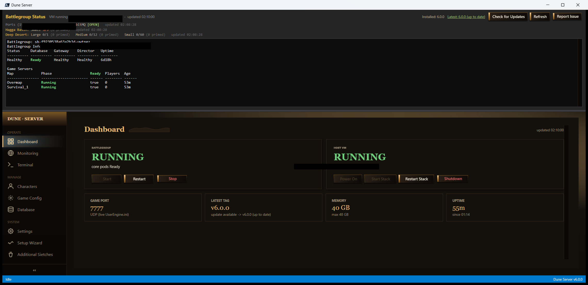
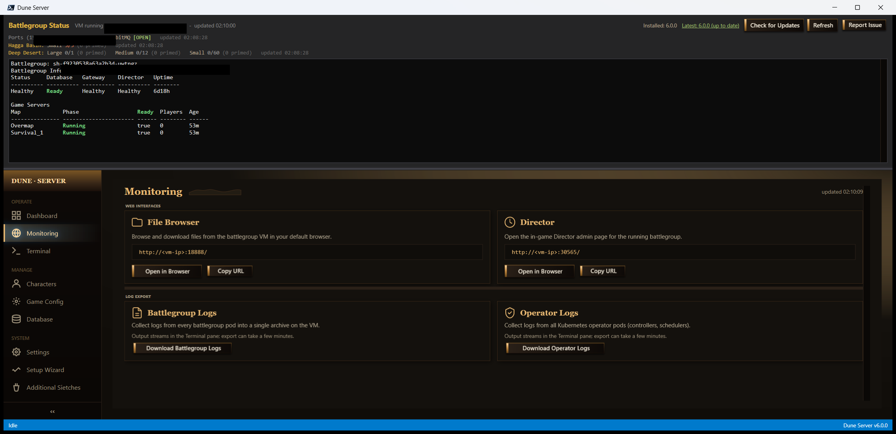
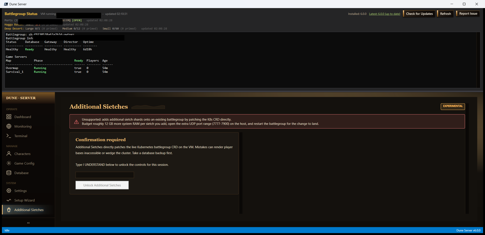

# Simple Dune Server Management Tool

> By Coastal (Discord `@allcoast`). A Windows desktop app for managing your
> self-hosted **Dune: Awakening** dedicated server — without ever opening a
> raw SSH shell or hand-editing YAML.

[](https://github.com/coastal-ms/Simple-Dune-Server-Management-Tool/actions/workflows/lint.yml)
[](LICENSE)
[](https://github.com/coastal-ms/Simple-Dune-Server-Management-Tool/releases/latest)

**v6.0.0** is a top-to-bottom rebuild around a page-based UI. You get a
Dashboard for at-a-glance status, dedicated pages for live character editing,
game-config tuning, database backup/restore, monitoring, and more — all
backed by the same battle-tested SSH + battlegroup automation under the hood.

> 🆕 **New in v6.1.3** — a prominent red **Shut down** button now lives in
> the top-right of the header (next to Refresh). One click gracefully stops
> the local `DuneServer.exe` portal process — no more digging in the system
> tray's right-click menu when you want to close the portal.

> 🎬 _Screenshot placeholder — replace with `docs/img/v6-dashboard.png` once captured._
>
> 

See [`CHANGELOG.md`](CHANGELOG.md) for the full release history and
[`CONTRIBUTING.md`](CONTRIBUTING.md) for the change-control workflow.

---

## Quick install

1. Download **`DuneServerSetup.exe`** from the
   [latest GitHub release](https://github.com/coastal-ms/Simple-Dune-Server-Management-Tool/releases/latest).
2. Double-click. The installer walks you through it (one UAC prompt — Hyper-V
   needs admin).
3. Launch from **Start Menu → Dune Server**. The first launch opens the
   **Setup Wizard**, which asks for your server install folder, SSH key, and
   optional dune-admin path. All answers are saved to `%APPDATA%\DuneServer\`
   and preserved across reinstalls.

> Already running v4.x or v5.x? The installer detects your existing
> `dune-server.config` (Desktop, OneDrive, common folders) and copies it to
> `%APPDATA%\DuneServer\` so nothing gets re-asked. Personal-folder paths
> are no longer scanned in v6.0.0 — only generic locations like Desktop and
> Documents.

---

## What you need

- **Windows 10/11** with **Hyper-V** enabled (Pro / Enterprise / Education).
- **PowerShell 7** (`pwsh`) — [download](https://github.com/PowerShell/PowerShell/releases). The app will prompt you with this link on first launch if it's missing.
- **WebView2 Evergreen runtime** — preinstalled on Windows 11; the app
  prompts with the official Microsoft installer link if it's missing on
  Windows 10 / Server.
- **Dune: Awakening Self-Hosted Server** installed via Steam (gives you the
  `battlegroup-management` folder and the Hyper-V VM image).
- **SSH private key** for connecting to your VM — created automatically
  during Funcom's official self-hosted setup; usually in
  `%LOCALAPPDATA%\DuneAwakeningServer\sshKey`.
- **(Optional)** [dune-admin](https://github.com/icehunter/dune-admin) — a
  community admin panel for player/inventory tooling. Launches from inside
  the app if you provide the path.

---

## The v6 desktop app — a page tour

The window is split into three regions: a **header status bar** at the top
(VM status, battlegroup state, public IP / port check, plus **Refresh** and
**Shut down** buttons on the right), a **left rail** to navigate pages,
and the **page surface** on the right. Every page is built from the same
theme so colors, spacing, and controls stay consistent.

The header is **resizable** — drag the splitter to give a page more room.
The window auto-sizes to ~75% of your working area on first launch (minus a
small width margin for ultrawides) and centers itself.

### 🏠 Dashboard

> 

At-a-glance tiles for everything you usually want to glance at:

- **VM** — running / stopped, IP address
- **Battlegroup** — phase + per-map pod state (Overmap, Survival_1, …)
- **Game Port** — live read from `UserEngine.ini` on the VM (the actual port
  the game server is listening on; refreshes when you save Game Config)
- **Public IP / Port Check** — open / closed / unknown badges
- **Restart / Stop / Start** buttons for fast operations without leaving
  the page

Tiles refresh every 30 seconds and on-demand when you trigger an action.

### 📈 Monitoring

> 

- **Status log** — live tail of the battlegroup status stream
- **Log export buttons** — pull logs from the operator or any pod with one
  click; saved to your local logs folder and opened in Explorer
- **Web Interfaces** card — quick-launch tiles for the **File Browser** and
  **Director** pages (with their resolved URLs visible and copyable)

### 👤 Characters

> 

Live editor for every character on your server, talking directly to the
Postgres pod over SSH. Pick a character from the rail, then tab through:

- **Stats** — health, stamina, hydration, vitality, abilities
- **Tech / Specs** — unlocked tech trees and intel
- **Economy** — currency, faction standing
- **Faction** — affiliation, rank
- **Inventory** — full item list with filters
- **Cosmetics** — equipped/unlocked skins, dyes, sigils

All edits are written back through `psql` with transactional safety. The
character list loads asynchronously with a loading overlay so the UI never
hangs on a slow VM.

### ⚙️ Game Config

> 

A safe in-app editor for `UserEngine.ini` and related server tuning files.
The header shows a **spice fields readout** (Hagga + Deep Desert lines with
primed counts) so you can sanity-check spawn density at a glance. Save
flushes the file back to the VM and invalidates the Dashboard's port cache
so any port change is reflected immediately.

### 🗄️ Database

> 

- **Backup** and **Import** the game DB without remembering pod names
- Browse and edit common tables directly (read-only by default; "Edit mode"
  toggle prevents accidental writes)
- One-click **Open psql shell** in the embedded terminal for ad-hoc queries

### 🔧 Settings

> 

All the things the old setup wizard asked you, but editable any time:
server install folder, SSH key path, dune-admin path, Windows username,
port-check URL template, color theme, log retention. Changes are saved on
the fly — no restart needed.

### 🧙 Setup Wizard

> 

Runs automatically on first launch and walks you through the same questions
as the legacy CLI wizard (server folder, SSH key, dune-admin, Windows
username, port-check). You can re-run it any time from Settings if you ever
need a clean reset.

### 🏜️ Additional Sietches _(experimental)_

> 

Experimental page for managing more than one battlegroup / VM from a single
window. Not yet production-ready; included so power users can preview it
and file feedback.

---

## Where things live

| Item                       | Path                                            |
| -------------------------- | ----------------------------------------------- |
| Install dir                | `C:\Program Files\Dune Server\`                 |
| Config / logs / state      | `%APPDATA%\DuneServer\`                         |
| Setup config               | `%APPDATA%\DuneServer\dune-server.config`       |
| Live transcript            | `%APPDATA%\DuneServer\.logs\dune-server-*.log`  |
| WebView2 debug log         | `%APPDATA%\DuneServer\webview2-debug.log`       |
| SSH key (created by Funcom)| `%LOCALAPPDATA%\DuneAwakeningServer\sshKey`     |
| Start Menu shortcut        | `Start → Dune Server → Dune Server`             |
| Add/Remove Programs        | _"Dune Server 6.0.0"_                           |

Uninstalling removes the install dir but **never touches
`%APPDATA%\DuneServer\`** — your config and logs are preserved if you ever
reinstall.

---

## Legacy CLI _(`dune-server.bat`)_

The original menu-driven CLI script is still in the repo and still works.
Clone the repo (or download the source zip), then double-click
`dune-server.bat`. The desktop app and the `.bat` file both call into the
same `dune-server.ps1` business logic — they're not separate codebases.

You'd typically use the CLI if you want to script a one-off command without
launching the GUI (e.g., from a scheduled task or another tool):

```powershell
.\dune-server.bat
```

It will prompt for the option letter / number from the classic menu. See
[`CHANGELOG.md`](CHANGELOG.md) under **[5.0.0]** for the last menu-focused
release notes if you need a refresher on the CLI commands.

---

## Reporting issues

Hit a bug, error, or unexpected behavior? **Please open a GitHub issue**
so it can be tracked and fixed:

> 👉 [**Open an issue**](https://github.com/coastal-ms/Simple-Dune-Server-Management-Tool/issues/new/choose) &nbsp;·&nbsp;
> [Browse existing issues](https://github.com/coastal-ms/Simple-Dune-Server-Management-Tool/issues)

The bug report form asks for:

- **Tool version** — shown in the app header (`Installed: x.y.z`) or by
  running `dune-server.bat -Cmd version`
- **Surface** — which v6 page (or the CLI / installer / update checker)
  you were on when the bug happened
- **Page / button / command** — the specific thing you clicked or typed
- **Environment** — OS build, PowerShell version, WebView2 runtime version
- **Diagnostics** — recent lines from the transcript log (auto-attached
  when you use the in-app or CLI **Report Issue** button)

The **Report Issue** button (app header, or `dune-server -Cmd report-issue`
from the CLI) pre-fills most of this for you and opens the GitHub form in
your browser. **Sanitize first** — remove IPs, hostnames, usernames, and
any key file contents before submitting.

Discord pings to `@allcoast` are fine for quick questions, but use the
issue tracker for anything that needs a fix — it keeps the history public
so other admins can find the same answer.

---

## Troubleshooting

### "pwsh is not recognized"
PowerShell 7 isn't installed. Download it from
[github.com/PowerShell/PowerShell/releases](https://github.com/PowerShell/PowerShell/releases)
and install. The app and the `.bat` launcher both require `pwsh`, not the
built-in Windows PowerShell 5.1.

### "WebView2 runtime is missing"
On Windows 10 / Server, the Evergreen WebView2 runtime may not be
preinstalled. The app prompts with the official Microsoft installer link;
download, install, then relaunch.

### "The script requires administrator privileges"
Hyper-V cmdlets need admin. The installer enables this automatically for
`DuneServer.exe`; for the CLI, right-click `dune-server.bat` → **Run as
administrator**, or click Yes on the UAC prompt.

### Dashboard Game Port shows "lookup failed"
The app couldn't read `UserEngine.ini` from the VM. Common causes:

- VM is stopped (the tile will show "VM not running" instead)
- SSH key path is wrong (check Settings)
- Battlegroup hasn't been started yet on this VM, so the INI doesn't exist
- Open the embedded terminal and run `shell-vm` to verify SSH manually

The cache TTL is 10 minutes, so the next refresh will retry automatically.
Saving the Game Config page clears the cache immediately.

### Characters page shows "no characters"
Confirm the database pod is `Running`:
- Dashboard → Battlegroup tile should show all pods Running
- Or open the embedded terminal and `shell-pod` → pick the `-db-` pod

If the pod is up but the list is empty, no players have ever logged in
yet — the player table only gets rows on first character creation.

### dune-admin won't find my SSH key
dune-admin looks for keys in this order:
1. `./sshKey` (same folder as the exe)
2. `~/.ssh/dune`
3. `~/.ssh/id_ed25519`

You may also need to set `HOME`:
```powershell
[System.Environment]::SetEnvironmentVariable("HOME", $env:USERPROFILE, "User")
```

### Port check shows `[CLOSED]` but the game works
Many port-check services don't truly probe UDP — they report "closed"
when they really mean "no UDP response". Confirm with a UDP-aware tool
like `nmap -sU -p 7777 <public-ip>` from another network before assuming
your forwarding is broken.

### I want to change my settings
Open the **Settings** page in the app, or delete
`%APPDATA%\DuneServer\dune-server.config` to re-run the Setup Wizard from
a clean slate.

---

## Notes

- The VM name is always `dune-awakening` and the SSH user is always `dune`
  — these match Funcom's official setup and can't be changed.
- The dune-admin web UI is at
  [https://dune-admin.layout.tools/#/players](https://dune-admin.layout.tools/#/players).
- This tool is **not affiliated with Funcom**. "Dune", "Dune: Awakening",
  and related trademarks are property of their respective owners.
