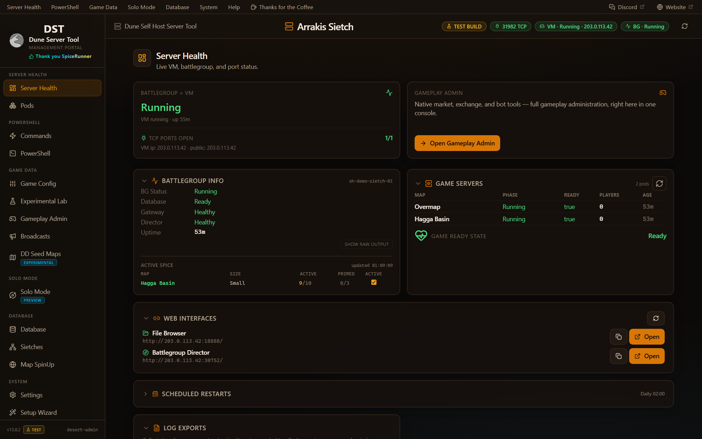
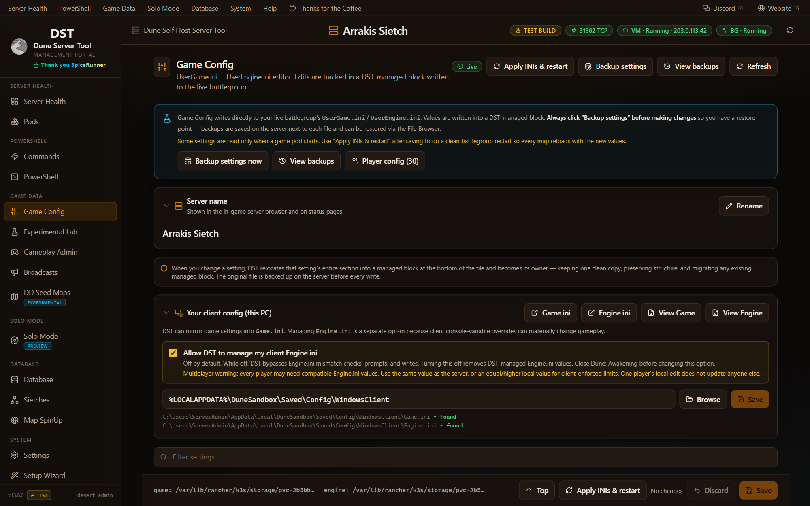
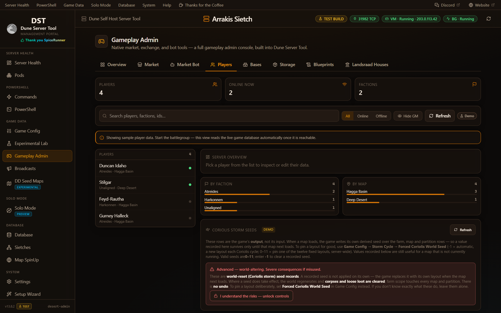
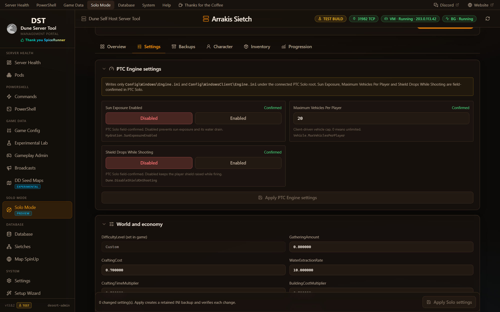
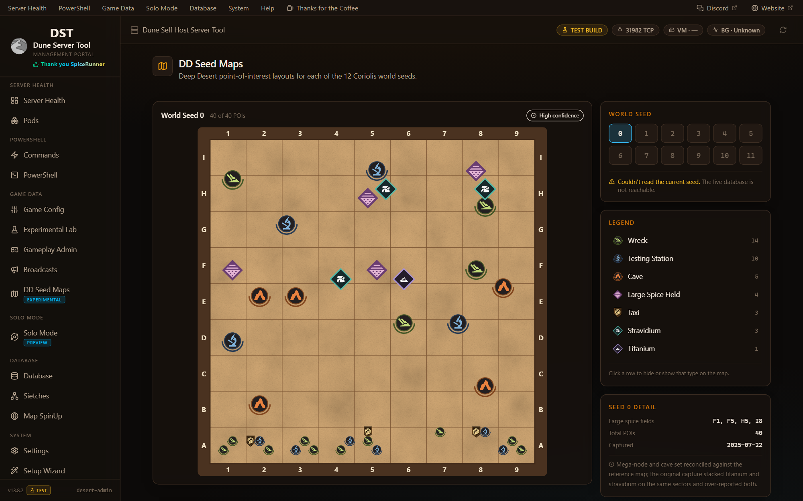
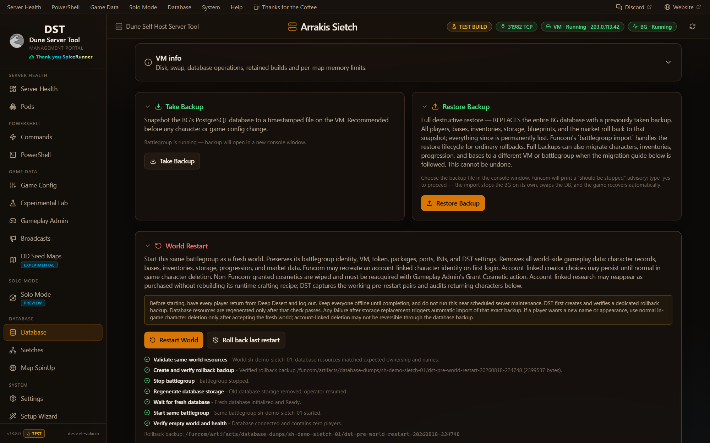
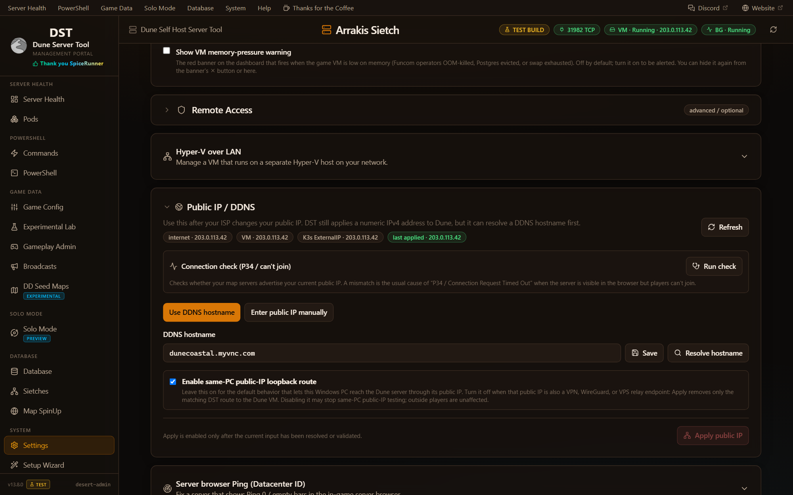

# DST - Dune Server Tool

> By Coastal (discord @allcoast)

Windows operations app for **Dune: Awakening** Self-Hosted servers and local
Solo saves.

[](https://github.com/coastal-ms/DST-DuneServerTool/actions/workflows/lint.yml)
[](LICENSE)
[](https://github.com/coastal-ms/DST-DuneServerTool/releases/latest)

**[Website and feature tour](https://coastal-ms.github.io/DST-DuneServerTool/) ·
[Install guide](https://coastal-ms.github.io/DST-DuneServerTool/install) ·
[Changelog](CHANGELOG.md) ·
[Discord](https://discord.gg/tj2x7cywSC)**

Current stable release: **v14.0.0**

Confirmed compatible with Dune: Awakening **1.4.10.4**.

## What DST does

DST replaces routine SSH, Kubernetes, PostgreSQL, INI, and Hyper-V work with
guarded controls in one native Windows app.

### Self-Hosted

- Monitor VM, battlegroup, pods, ports, memory pressure, spice, and maps.
- Start, stop, restart, update, and diagnose the Funcom server stack.
- Edit server and local-client INIs through typed, backed-up controls.
- Manage PostgreSQL backups, restores, schedules, imports, SQL, and migrations.
- Administer players, bases, storage, blueprints, Landsraad, and the Exchange.
- Run Duke's native Market Bot with formula or market-follow pricing.
- Manage one local VM or a separate Hyper-V host over LAN.
- Use the responsive full Browser Portal from a phone, tablet, or PC with
  optional host-managed Owner and Admin accounts.

### Solo Mode

- Connect one local PTC Solo save without Self-Hosted setup.
- Validate wrapper, SQLite integrity, foreign keys, schema, and character count.
- Create, restore, and delete retained backups.
- Edit typed Solo and confirmed Engine settings.
- Manage items, packages, vehicle kits, cosmetics, currencies, and fillables.
- Max augments and run verified specialization, Find the Fremen, and skill actions.

Solo mutations require Dune to be closed. DST retains the current save, writes
atomically, verifies the result, and rolls back automatically on failure.

## Seven core surfaces

<details open>
<summary><strong>Server Health</strong></summary>



VM and battlegroup state, database and gateway health, game pods, ports, active
spice, scheduled restarts, memory warnings, interfaces, and log exports.
</details>

<details>
<summary><strong>Game Config</strong></summary>



Typed `UserGame.ini` and `UserEngine.ini` controls, Funcom defaults, backups,
DST-managed blocks, local-client mirroring, and isolated Experimental features.
</details>

<details>
<summary><strong>Gameplay Admin</strong></summary>



Players, Market, Market Bot, Bases, Storage, Blueprints, Landsraad Houses,
packages, vehicle kits, cosmetics, progression, teleports, and guarded writes.
</details>

<details>
<summary><strong>Solo Mode</strong></summary>



Validated local-save settings, backups, character and inventory tools,
currencies, fillables, cosmetics, packages, augments, and progression.
</details>

<details>
<summary><strong>DD Seed Maps</strong></summary>



Interactive POI maps for all 12 Coriolis seeds with legend filters, confidence
notes, farm-seed selection, and running-map seed detection.
</details>

<details>
<summary><strong>Database</strong></summary>



Backup, restore, import, local mirror, scheduling, SQL, migration tools, and
guarded World Restart testing.
</details>

<details>
<summary><strong>Settings</strong></summary>



Updates, installation, themes, warnings, Remote Device Access, Browser Portal
accounts, Hyper-V over LAN, Public IP/DDNS, browser ping, and host-local
preferences.
</details>

## Safety model

- Local admin portal binds to loopback with a per-launch token.
- PowerShell, Solo Mode, Setup, host paths, credentials, and SSH controls remain
  host-local. Remote Admins also cannot access Game Config, Experimental,
  Database, Sietches, or Settings.
- Destructive actions require explicit confirmation and use narrow write scopes.
- Database and save mutations use backups, verification, and recovery paths.
- Player state determines whether an action requires the player online or offline.
- Experimental features are isolated and never presented as field-proven.
- Secrets are excluded from diagnostics and never stored in repository files.

## Install

1. Download `DuneServerSetup.exe` from the
   [latest GitHub release](https://github.com/coastal-ms/DST-DuneServerTool/releases/latest).
2. Run the installer.
3. Launch **Dune Server** from the Start Menu.
4. Choose an existing local VM, a fresh local install, Hyper-V over LAN, or use
   Solo Mode independently.

### Requirements

- Windows 10 or 11.
- PowerShell 7.
- Microsoft Edge WebView2 Runtime.
- For Self-Hosted: Funcom's Dune: Awakening Self-Hosted Server package, Hyper-V
  locally or on a reachable LAN host, and the VM SSH key.
- For Solo Mode: a supported local Dune Solo save. No VM is required.

Full setup, remote access, Hyper-V-over-LAN, and path guidance:
**[Install guide](https://coastal-ms.github.io/DST-DuneServerTool/install)**.

## Local paths

| Purpose | Path |
| --- | --- |
| Installed app | `C:\Program Files\Dune Server\` |
| Config and state | `%APPDATA%\DuneServer\` |
| Runtime logs and URL | `%LOCALAPPDATA%\DuneServer\` |
| Default VM key | `%LOCALAPPDATA%\DuneAwakeningServer\sshKey` |

## Support and releases

- Questions and community help: [DST Discord](https://discord.gg/tj2x7cywSC)
- Reproducible bugs: [open an issue](https://github.com/coastal-ms/DST-DuneServerTool/issues/new/choose)
- Stable and named test builds: [GitHub Releases](https://github.com/coastal-ms/DST-DuneServerTool/releases)
- Active test guidance: [testing page](https://coastal-ms.github.io/DST-DuneServerTool/testing)
- Full release history: [CHANGELOG.md](CHANGELOG.md)

Diagnostics are available from **Help -> Export diagnostics**. Attach the
generated ZIP to bug reports instead of posting secrets or raw credentials.

## Build from source

Requires PowerShell 7, Node.js, .NET SDK, and Inno Setup 6.

```powershell
pwsh app/installer/Build-Installer.ps1
```

Output:

```text
app/installer/output/DuneServerSetup.exe
```

Fast checks:

```powershell
cd webui
npm ci
npm run build
npm test
```

See [CONTRIBUTING.md](CONTRIBUTING.md) for repository workflow and release
requirements.

## License

DST is released under the [Apache License 2.0](LICENSE). Redistributions must
preserve [NOTICE](NOTICE) and credit Coastal as the original author.
