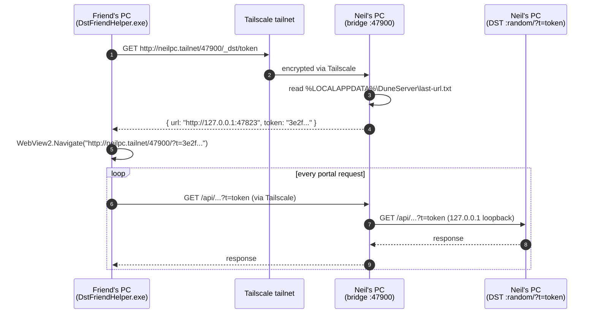

# DST Friend Helper

A standalone Windows app a trusted friend double-clicks on **his** PC to
get into Neil's full DST desktop portal running on **Neil's** PC. Built as
a purely additive scaffold on top of the released DST surface — **zero
changes to `app/`, `webui/`, `site/`, or `dune-server.ps1`.**

## Components

```
helper/
├── bridge/                 # Runs on Neil's PC (long-lived, scheduled task)
│   ├── DstHelperBridge.ps1
│   ├── Install-Bridge.ps1
│   ├── Uninstall-Bridge.ps1
│   └── README.md
└── friend/                 # Ships to the friend (single .exe + config.json)
    ├── DstFriendHelper.csproj
    ├── App.xaml(.cs)
    ├── MainWindow.xaml(.cs)
    ├── Config.cs
    ├── app.manifest
    ├── config.sample.json
    ├── Build-FriendHelper.ps1
    └── README.md
```

See each subdirectory's `README.md` for the install / build steps.

## Data flow



## Trust boundaries

| Layer                | What it gates                                                  |
| -------------------- | -------------------------------------------------------------- |
| Tailscale tailnet    | Only devices Neil has added can route to his machine at all.   |
| Tailscale ACL        | Friend's device tag can only reach port 47900 on Neil's host.  |
| Windows Firewall     | Port 47900 is allowed inbound **only on the Tailscale NIC**.   |
| DuneToken (?t=)      | Defense-in-depth — DST itself still requires a valid token.    |

Defeating this requires (a) Neil-issued tailnet membership, (b) the
friend's specific device tag in the ACL, **and** (c) capturing the
current DuneToken — which is rotated on every DST launch.

## Why this design

- **Tailscale, not Cloudflare Tunnel.** The existing `/remote/*` SPA
  already uses CF Tunnel + Access for a mobile-friendly subset. This
  scaffold targets a *different* use case: a single trusted friend who
  wants the **full** desktop portal (Database, Terminal, Setup Wizard,
  everything Neil sees). Tailscale gives identity-based access without
  per-domain edge config, and friends don't need to set up an IdP.
- **No DST code changes.** The bridge is a pure reverse proxy that reads
  the existing `last-url.txt` (DST already writes this for the desktop
  shell). DST stays on the **released** v11.0.3 surface — no risk of
  breaking the released app while iterating on the helper.
- **WPF + WebView2, no ps2exe.** The DST v11.0.1–v11.0.3 Defender
  saga taught us that any base64-pipe-decode-exec pattern gets
  flagged as `Trojan:Win32/Wacatac.B!ml`. WPF compiled .NET is a
  normal benign Windows app.

## Setup checklist

### Neil's side

- [ ] Tailscale installed + signed in. `Get-NetIPInterface | ? InterfaceAlias -eq 'Tailscale'` returns a row.
- [ ] PowerShell 7 (`pwsh.exe`) on PATH.
- [ ] DST runs at least once so `%LOCALAPPDATA%\DuneServer\last-url.txt` exists.
- [ ] Run `helper\bridge\Install-Bridge.ps1` from an **elevated** pwsh.
- [ ] Verify locally: `curl http://127.0.0.1:47900/_dst/health` → `{"ok":true}`.
- [ ] Tag the host device `tag:dst-host` in the Tailscale admin panel.
- [ ] Add the friend's device, tag it `tag:dst-friend`, and add the ACL
      stanza shown in `helper/bridge/README.md`.
- [ ] Build the friend .exe: `helper\friend\Build-FriendHelper.ps1`.
- [ ] Send `dist\DstFriendHelper.exe` + `dist\config.json` to the friend
      (set `bridgeHost` to your Tailscale hostname first, or let the
      friend do it).

### Friend's side

- [ ] Install Tailscale and accept Neil's invite.
- [ ] Drop `DstFriendHelper.exe` and `config.json` in any folder.
- [ ] Open `config.json`, set `bridgeHost` if Neil didn't pre-fill it.
- [ ] Double-click `DstFriendHelper.exe`.

## Known limitations (scaffold scope)

- **No WebSocket proxy.** Terminal page won't work for the friend
  (HttpClient-based reverse proxy doesn't speak `Upgrade: websocket`).
  Everything else in the portal does.
- **Single concurrent request** through the bridge. One friend, one
  request at a time. Fine.
- **No code-signing.** Friend's first launch will trip SmartScreen
  unless you sign the .exe with the same EV cert used for
  `DuneServerSetup.exe`.
